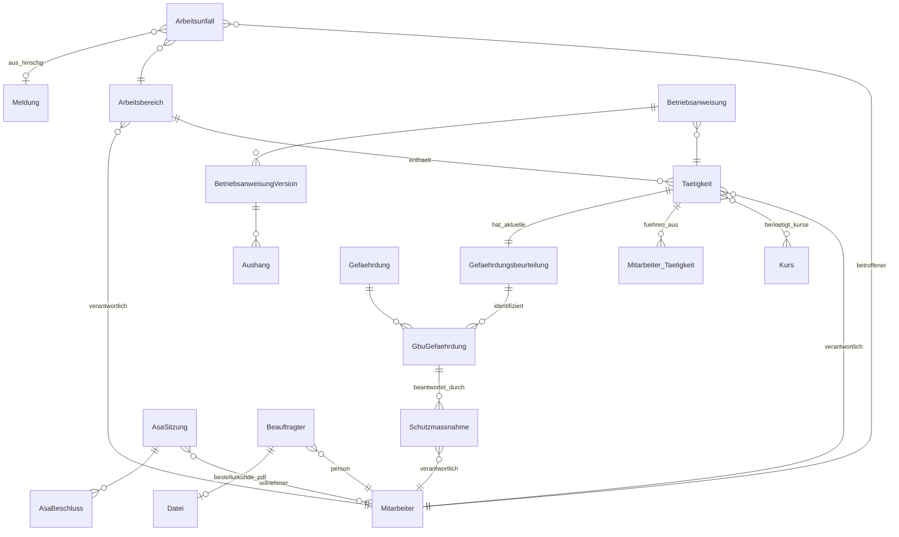
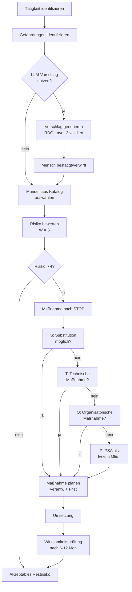

# Spec — Phase 3: Arbeitsschutz / Gefährdungsbeurteilung

| | |
|---|---|
| **Status** | Draft (Brainstorming abgeschlossen, wartet auf User-Review) |
| **Autor** | Claude (Architektur-Session 2026-05-17) |
| **Datum** | 2026-05-17 |
| **Scope** | Vollständiges Arbeitsschutz-Modul: Gefährdungsbeurteilung (GBU), ASA-Sitzungen, Arbeitsunfall-Meldungen, Beauftragten-Register, Betriebsanweisungen. Tiefe Integration in das bestehende Pflichtunterweisungs-Modul. |
| **Out of Scope** | Vollständige DGUV-Vorschriften-Datenbank (nur Subset im Seed), automatische BG-Schnittstelle (manuell-Workflow), Maschinen-/Anlagen-Lifecycle, CE-Konformitätsbewertung (eigenes Modul Phase 4), Gefahrstoff-Kataster (eigenes Modul Phase 4), Gefährdungs-Beurteilung psychischer Belastung als eigenes Verfahren nach GBpsych — wir nutzen die generische GBU-Engine, fertige Frage-Tools (BAuA, COPSOQ) kommen Phase 4. |
| **Vorgänger-Specs** | `2026-04-24-mvp-architecture-design.md`, `2026-05-09-sprint-4-pflichtunterweisung.md`, `2026-05-09-sprint-5-hinschg.md` (Encryption-Pattern), `2026-05-09-sprint-5-datenpannen` (Vorfalls-Pattern) |
| **Folge-Dokumente** | `2026-05-17-phase3-arbeitsschutz-plan.md` (5 Sub-Slices) |

---

## 1. Motivation

Vaeren positioniert sich als „Compliance-Autopilot für den Industrie-Mittelstand". Die bisher implementierten Module (Pflichtunterweisung, HinSchG, Datenpannen, NIS2, KI-Inventar) decken die **Querschnitt-Compliance** ab — also Themen, die jedes Unternehmen betreffen, unabhängig von der Branche. Was fehlt: das **operativ tägliche Compliance-Handwerk**, das die Zielgruppe (Maschinenbau, Metall, Kunststoff, Automotive-Zulieferer mit 50–300 MA) bereits heute in Excel-Tabellen, Word-Dokumenten und proprietärer Branchen-Software pflegt — schlecht und unter Schmerzen.

**Arbeitsschutz nach ArbSchG/DGUV ist für diese ICP-Gruppe das Compliance-Thema Nummer 1.** Drei Gründe:

1. **Operative Frequenz.** GBU, Unterweisungen, ASA-Sitzungen, Beauftragten-Bestellungen sind kein Jahrespflicht-Häkchen, sondern Wochengeschäft. Eine Vaeren-Lösung hier ist sichtbar, weil sie täglich benutzt wird — anders als ein DSGVO-Modul, das nur bei Vorfällen aktiviert wird.
2. **Sales-Hebel.** Geschäftsführer in der Produktion können sich der GBU-Pflicht nicht entziehen (persönliche Haftung nach §13 ArbSchG, OWiG-Bußgelder bis 30 000 €, im Schadensfall strafrechtliche Verantwortung). Wenn Vaeren das Thema sauber löst, kauft die GF — nicht der Compliance-Officer.
3. **Bundle-Synergie.** GBU + DGUV-Pflichtunterweisungen sind heute künstlich getrennt: GBU-Tools (Quentic, BIA, EcoIntense) decken Schulungen nicht ab, Schulungs-Tools (HOFE, Lecturio Compliance) decken GBU nicht ab. Wer beides in einem Produkt vereint, hat einen klaren USP. Vaeren hat die Pflichtunterweisungs-Engine bereits — der Aufwand für GBU darüber wird dadurch deutlich geringer.

Dieses Modul ist deshalb der wichtigste Phase-3-Baustein. Es ist gleichzeitig groß genug, dass es in fünf vertikale Slices (jeder allein launch-bar) geschnitten wird — kein Big-Bang-Release.

---

## 2. Geltungsbereich & rechtliche Verankerung

| Pflicht | Rechtsgrundlage | Frist/Quote |
|---|---|---|
| Gefährdungsbeurteilung pro Tätigkeit, dokumentiert | ArbSchG §5 + §6 | Bei Aufnahme der Tätigkeit, Aktualisierung „bei wesentlicher Änderung", Empfehlung BAuA: jährliche Überprüfung |
| Unterweisung der Beschäftigten | ArbSchG §12, DGUV V1 §4 | Bei Einstellung + min. 1× jährlich + bei Tätigkeitsänderung |
| Arbeitsschutzausschuss (ASA) | ASiG §11 | Pflicht ab 21 regelmäßig Beschäftigten, quartalsweise Sitzung |
| Bestellung Sicherheitsbeauftragter (SiBe) | SGB VII §22 | Pflicht ab 21 regelmäßig Beschäftigten, mindestens 1 SiBe pro 20 MA in Produktion |
| Bestellung Brandschutzbeauftragter | ASR A2.2 + Sachversicherer-Auflagen | Risiko-abhängig; in Produktion praktisch immer |
| Ersthelfer-Quote | DGUV V1 §26 | 1 Ersthelfer pro 10 MA Büro / 1 pro 5 MA Produktion |
| Unfall-Meldung an Berufsgenossenschaft | SGB VII §193 | Unverzüglich, spätestens binnen 3 Werktagen bei Arbeitsunfähigkeit > 3 Tage; sofortige Meldung bei Tod/Schwerverletzung |
| Betriebsanweisung für Maschinen, Gefahrstoffe, PSA | BetrSichV §12, GefStoffV §14 | Vor erster Verwendung, Aushang + Kenntnisnahme dokumentieren |

**Wichtig:** Wir bauen ein Werkzeug zur **Selbst-Dokumentation und Nachweis-Führung**. Wir geben keine Rechtsberatung. Jede GBU-Bewertung, Risikoeinstufung und Maßnahmen-Auswahl wird vom Tenant-Mitarbeiter (qualifizierte Fachkraft für Arbeitssicherheit oder externe Fasi) verantwortet. LLM darf Vorschläge generieren — nie freigeben. RDG-3-Layer-Pattern aus dem MVP (`CLAUDE.md` §1) gilt 1:1.

---

## 3. Architektur-Entscheidungen

| Entscheidung | Wahl | Begründung |
|---|---|---|
| **Modul-Struktur** | Eine Django-App `arbeitsschutz/` mit klar getrennten Submodulen (`gbu.py`, `asa.py`, `unfall.py`, `beauftragte.py`, `betriebsanweisung.py`) statt 5 Apps. | Alle Submodule teilen Stammdaten (Arbeitsbereich, Tätigkeit, Mitarbeiter). Cross-App-FKs sind in Multi-Tenant-Setup teurer als Single-App-FKs. Konrad muss Migrations-Reihenfolge nicht pro Slice verwalten. |
| **Stammdaten-Owner** | `Arbeitsbereich` + `Taetigkeit` sind die Backbone-Tabellen, von denen GBU, ASA-Themen, Unfälle, Betriebsanweisungen referenzieren. | DDD-Prinzip: gemeinsamer Bounded Context „Arbeitsplatz". Vermeidet Duplizierung („Hallenname" in 4 Modellen). |
| **Gefährdungs-Katalog** | Geseedet mit ~100 Gefährdungen aus DGUV-Kompendium („Faktor Mensch — Faktor Technik — Faktor Organisation"), als read-only Vaeren-Standard im Tenant nutzbar (analog Kurs-Katalog). Tenant darf eigene `Gefaehrdung` mit `eigentuemer_tenant != ""` ergänzen. | Pattern bewährt sich beim Kurs-Katalog (Slice eigene-kurse). Pilot-Kunden wollen ihre Tradition („Halle-3-Spezialgefährdungen") behalten. |
| **Risikomatrix** | 5×5-Matrix (Wahrscheinlichkeit 1–5 × Schwere 1–5 → Risiko 1–25), Standard nach Nohl/BG-Empfehlung, Konfiguration auf Tenant-Ebene optional (Phase 3.5). | 3×3 zu grob, 7×7 schreckt KMU ab. 5×5 ist DGUV-Standard-Empfehlung und der einzige Default, den Konrad zur Pilotierung verteidigen kann. |
| **STOP-Hierarchie** | `Schutzmassnahme.hierarchie_stufe` als TextChoices (S, T, O, P). UI zeigt sie sortiert und blockt Anlage von P/O, wenn S/T nicht geprüft wurde. | ArbSchG §4 schreibt STOP zwingend vor (S → T → O → P, niemals umgekehrt). UI-Gate schützt Tenants vor BG-Audit-Findings. |
| **Polymorphic-Tasks** | Pro relevanter Pflicht eigene `ComplianceTask`-Subklasse: `GbuReviewTask`, `MassnahmeTask`, `AsaSitzungTask`, `UnfallMeldungTask`, `BeauftragterBestellungTask`, `BetriebsanweisungReviewTask`. Auto-Erzeugung via Signals (Pattern aus `datenpannen/signals.py`). | Bestehende Cockpit-Logik (Score, Activity-Feed, Notification-Bell) konsumiert ComplianceTask. Wir bekommen Dashboard-Integration gratis. |
| **Encryption** | `Arbeitsunfall.beschreibung_verschluesselt` + `verletzungsart_verschluesselt` + `betroffener_name_verschluesselt` als `EncryptedTextField` (Fernet, Pattern aus HinSchG/Datenpannen). | Unfälle enthalten Gesundheitsdaten (Art. 9 DSGVO) — at-rest-Verschlüsselung schließt rechtliches Restrisiko, ist null Mehraufwand weil das Field bereits existiert. Andere Felder (`datum`, `arbeitsbereich`, `ausfalltage`) bleiben unverschlüsselt für Statistik. |
| **LLM-Einsatz** | Drei klar abgegrenzte Punkte: (a) GBU-Wizard schlägt typische Gefährdungen für eine Tätigkeit vor („Schweißen → mechanisch, thermisch, optische Strahlung, Lärm, Atemwege"), (b) Maßnahmen-Vorschlag pro Gefährdung mit STOP-Klassifizierung, (c) Betriebsanweisung-Entwurf aus Tätigkeit + identifizierten Gefährdungen. Alle drei laufen über `core.llm.suggest()` mit Output-Validator gegen verbotene Bewertungs-Formeln und HITL-Bestätigung. | RDG-Layer-3. Niemals LLM-Auto-Übernahme. Konrad bestätigt jede Akzeptanz in Pilot-Phase manuell. |
| **Beauftragten-Quoten** | Quoten-Berechnung im Code als reine Funktion (`beauftragte.quoten.berechne(mitarbeiter_qs)`), pro Beauftragten-Typ. UI zeigt Soll/Ist mit Ampel. Auto-Task „SiBe bestellen" wenn Soll > Ist. | Keine eigene Tabelle für Quoten — die Regeln (1/20, 1/10, 1/5) sind Code, kein konfigurierbares Stammdatum. YAGNI bis Sonderbranchen. |
| **Frist-Berechnung Unfall-Meldung** | Pflichtfrist hängt von Verletzungsschwere ab: tödlich/schwer → sofort (Frist „now"), >3 Tage AU → 3 Werktage, Bagatell → keine BG-Meldung. Werktag-Berechnung via `core.fristen.werktage_addieren()` (existiert ggf. nicht — falls nicht, anlegen). | SGB VII §193. Werktag-Logik braucht Feiertags-Kalender DE (BL-spezifisch). MVP: bundeseinheitliche Feiertage, BL-Erweiterung Phase 3.5. |
| **Anonymisierung Unfall ↔ HinSchG** | Wenn der Unfall einer HinSchG-Meldung entspringt (z.B. Hinweisgeber meldet Beinahe-Unfall), bleibt der Hinweisgeber im HinSchG-Schema verschlüsselt; der `Arbeitsunfall` bekommt ein Flag `aus_hinschg=True` und nur die anonymisierte Beschreibung. Cross-Modul-Link ist `meldung_id`, aber Fremdschlüssel ist NULL-able, damit Löschung der HinSchG-Meldung den Unfall nicht killt. | HinSchG-Vertraulichkeit ist absolut. Wenn der Hinweisgeber „Maschine X ist gefährlich" sagt, darf der Arbeitsunfall-Eintrag das Faktum tracken, aber nicht die Quelle. |
| **Pflichtunterweisungs-Verlinkung** | `Taetigkeit.benoetigt_kurse = M2M(Kurs)`. Bei Mitarbeiter-Zuordnung zu Tätigkeit prüft ein Signal: hat MA gültige Kurszertifikate? Wenn nein → automatische `SchulungsWelle` im pflichtunterweisung-Modul erstellen (DRAFT, GF muss versenden). | Bundle-Synergie. Kein Doppelpflegen. Aber: Wir versenden Wellen niemals automatisch, weil GF kuratiert (Termin, Tonalität, Reihenfolge). |
| **Compliance-Index-Gewichtung** | Neuer Modul-Score `arbeitsschutz` mit Sub-Komponenten: GBU-Quote (40%), Maßnahmen-Erledigung (30%), ASA-Frequenz (10%), Beauftragten-Quote (10%), Unfall-Trend (10%). Master-Formel wird angepasst: 0,40 × Pflichten + 0,15 × Fristen + 0,45 × Module (statt 0,50/0,20/0,30). Modul-Anzahl wächst dann auf 6, Module-Score = Durchschnitt. | Arbeitsschutz ist für ICP der relevanteste Score-Treiber. Master-Reweighting ist eine bewusste Konrad-Entscheidung — vor Rollout in Pilot-Phase explizit prüfen, ob die neue Formel bestehende Tenants nicht über Nacht „rot" macht. |
| **Frontend-Routing** | `/arbeitsschutz` (Dashboard), `/arbeitsschutz/struktur` (Arbeitsbereiche+Tätigkeiten), `/arbeitsschutz/gbu/:id` (GBU-Wizard mehrstufig), `/arbeitsschutz/asa` (ASA-Kalender), `/arbeitsschutz/unfaelle` (Unfall-Liste), `/arbeitsschutz/beauftragte` (Register), `/arbeitsschutz/betriebsanweisungen` (Bibliothek). | Eine Sidebar-Sektion „Arbeitsschutz" mit Sub-Routes, analog Pflichtunterweisung. Cockpit-Card linked dorthin. |
| **Performance-Annahmen** | Realistischer Tenant (100 MA): ~10 Arbeitsbereiche, ~30 Tätigkeiten, ~150 Gefährdungs-Zuordnungen, ~80 Maßnahmen, ~20 Beauftragte, ~5 Unfälle/Jahr. Listen mit Pagination 50 Einträge. GBU-Detail lädt alle Gefährdungen + Maßnahmen einer Tätigkeit (< 30 Rows, kein Problem). Risikomatrix-Heatmap rendert clientseitig 25 Zellen. | Selbst der größte realistische Tenant (300 MA, 50 Tätigkeiten, 250 Gefährdungen, 150 Maßnahmen) bleibt unter 1k Rows pro Tabelle. Kein Background-Job nötig, kein Caching, simple Querysets. |
| **Out-of-Scope** | Mobile-App für Werkstatt-Erfassung (Phase 4 — PWA reicht im MVP), Foto-Upload zu Unfall/GBU (Phase 4 — File-Asset-Engine müsste erweitert werden), GefStoffV-Gefahrstoff-Kataster (eigenes Modul Phase 4 — schwer abgrenzbar), psychische GBU mit standardisierten Fragebögen (Phase 4), Audit-Trail-Vergleich zwischen GBU-Versionen (Phase 3.5), automatische BG-Online-Anmeldung (kein offenes API existiert). | YAGNI bis Pilot-Feedback. Die Liste ist explizit, damit Konrad bei späteren Scope-Diskussionen darauf zeigen kann. |

---

## 4. Datenmodell



### 4.1 Stammdaten

```python
class Arbeitsbereich(models.Model):
    """Räumlich-organisatorische Einheit (Werkstatt, Lager, Büro, Außenmontage)."""
    name = CharField(max_length=200)
    typ = CharField(choices=ArbeitsbereichTyp.choices)  # werkstatt|lager|buero|labor|aussen|lieferung|sonstiges
    standort = CharField(max_length=200, blank=True)  # Adresse oder Halle-Bezeichnung
    verantwortlicher = ForeignKey(Mitarbeiter, on_delete=PROTECT, related_name="verantwortet_bereiche")
    beschreibung = TextField(blank=True)
    aktiv = BooleanField(default=True)
    created_at = DateTimeField(auto_now_add=True)


class Taetigkeit(models.Model):
    """Konkrete Tätigkeit innerhalb eines Bereichs (Schweißen, Drehen, Bildschirmarbeit ...)."""
    arbeitsbereich = ForeignKey(Arbeitsbereich, on_delete=PROTECT, related_name="taetigkeiten")
    name = CharField(max_length=200)
    beschreibung = TextField(blank=True)
    verantwortlicher = ForeignKey(Mitarbeiter, on_delete=PROTECT, related_name="verantwortet_taetigkeiten")
    benoetigt_kurse = ManyToManyField(
        "pflichtunterweisung.Kurs", blank=True, related_name="pflicht_fuer_taetigkeiten",
        help_text="Welche Pflichtunterweisungen muessen MA dieser Taetigkeit haben?")
    aktiv = BooleanField(default=True)
    created_at = DateTimeField(auto_now_add=True)


class MitarbeiterTaetigkeit(models.Model):
    """Through-Model — welcher MA fuehrt welche Taetigkeit aus, seit wann."""
    mitarbeiter = ForeignKey(Mitarbeiter, on_delete=CASCADE)
    taetigkeit = ForeignKey(Taetigkeit, on_delete=CASCADE)
    seit = DateField()
    bis = DateField(null=True, blank=True)

    class Meta:
        unique_together = (("mitarbeiter", "taetigkeit", "seit"),)
```

### 4.2 Gefährdungs-Katalog

```python
class GefaehrdungKategorie(TextChoices):
    MECHANISCH = "mechanisch", "Mechanisch"
    ELEKTRISCH = "elektrisch", "Elektrisch"
    GEFAHRSTOFFE = "gefahrstoffe", "Gefahrstoffe"
    BIOLOGISCH = "biologisch", "Biologisch"
    BRAND_EXPLOSION = "brand_explosion", "Brand- und Explosionsgefährdungen"
    THERMISCH = "thermisch", "Thermisch (Hitze/Kälte)"
    LAERM = "laerm", "Lärm"
    VIBRATION = "vibration", "Vibration"
    STRAHLUNG = "strahlung", "Strahlung (UV, IR, ionisierend)"
    ERGONOMIE = "ergonomie", "Ergonomie / Physische Belastung"
    PSYCHISCH = "psychisch", "Psychische Belastung"
    ORGANISATORISCH = "organisatorisch", "Organisation / Arbeitsablauf"


class Gefaehrdung(models.Model):
    """Katalog-Eintrag. Vaeren-Standard (eigentuemer_tenant=='') ist read-only."""
    code = CharField(max_length=40, db_index=True)  # z.B. "MECH-002" oder "TENANT-XYZ-007"
    name = CharField(max_length=200)
    kategorie = CharField(choices=GefaehrdungKategorie.choices)
    beschreibung = TextField()
    hinweis_arbeitsbereich = CharField(max_length=200, blank=True,
        help_text="Typischerweise vorkommend in: 'Werkstatt', 'Aussenmontage' etc.")
    rechtsgrundlage = CharField(max_length=200, blank=True)  # z.B. "DGUV V1 §4 Abs. 1"
    eigentuemer_tenant = CharField(max_length=63, blank=True)  # leer = Standard
    aktiv = BooleanField(default=True)

    class Meta:
        unique_together = (("code", "eigentuemer_tenant"),)
```

**Seed:** ~100 Einträge, ableitbar aus DGUV-Vorschrift „Gefaehrdungsfaktoren-Kompendium" (BAuA). Verteilung grob: mechanisch 18, elektrisch 6, gefahrstoffe 12, biologisch 5, brand/explosion 7, thermisch 5, lärm 4, vibration 3, strahlung 6, ergonomie 12, psychisch 10, organisatorisch 12.

### 4.3 Gefährdungsbeurteilung (GBU)

```python
class GbuStatus(TextChoices):
    ENTWURF = "entwurf", "Entwurf"
    IN_BEWERTUNG = "in_bewertung", "In Bewertung"
    FREIGEGEBEN = "freigegeben", "Freigegeben"
    ZU_UEBERARBEITEN = "zu_ueberarbeiten", "Zu überarbeiten"


class Gefaehrdungsbeurteilung(models.Model):
    """Eine GBU = ein Snapshot der Risikoanalyse fuer eine Taetigkeit zu einem Zeitpunkt."""
    taetigkeit = ForeignKey(Taetigkeit, on_delete=PROTECT, related_name="gbus")
    titel = CharField(max_length=200)
    status = CharField(choices=GbuStatus.choices, default=GbuStatus.ENTWURF)
    verantwortlicher = ForeignKey(Mitarbeiter, on_delete=PROTECT)
    erstellt_von = ForeignKey(settings.AUTH_USER_MODEL, on_delete=PROTECT,
                              related_name="erstellte_gbus")
    erstellt_am = DateTimeField(auto_now_add=True)
    freigegeben_am = DateTimeField(null=True, blank=True)
    freigegeben_von = ForeignKey(settings.AUTH_USER_MODEL, null=True, blank=True,
                                  on_delete=PROTECT, related_name="freigegebene_gbus")
    wirksamkeitspruefung_faellig_am = DateField(
        help_text="Default: freigabe_datum + 12 Monate. UI erinnert.")
    bemerkung = TextField(blank=True)

    # Auto-Property: ist_aktuell — neueste FREIGEGEBENE GBU pro Taetigkeit
    @property
    def ist_aktuell(self) -> bool: ...


class GbuGefaehrdung(models.Model):
    """M:N Through — eine Gefaehrdung in einer konkreten GBU mit Bewertung."""
    gbu = ForeignKey(Gefaehrdungsbeurteilung, on_delete=CASCADE, related_name="positionen")
    gefaehrdung = ForeignKey(Gefaehrdung, on_delete=PROTECT)
    freitext_ergaenzung = TextField(blank=True,
        help_text="Tenant-spezifische Erlaeuterung zur Standard-Gefaehrdung.")
    wahrscheinlichkeit = PositiveSmallIntegerField(
        choices=[(i, str(i)) for i in range(1, 6)])
    schwere = PositiveSmallIntegerField(
        choices=[(i, str(i)) for i in range(1, 6)])
    relevant = BooleanField(default=True,
        help_text="False = im Katalog aufgefuehrt, hier aber nicht zutreffend (mit Begruendung).")
    nicht_relevant_begruendung = TextField(blank=True)

    @property
    def risiko_score(self) -> int:
        return self.wahrscheinlichkeit * self.schwere  # 1..25

    @property
    def risiko_klasse(self) -> str:  # gering<=4, mittel<=9, hoch<=15, sehr_hoch<=25
        ...

    class Meta:
        unique_together = (("gbu", "gefaehrdung"),)


class StopHierarchie(TextChoices):
    SUBSTITUTION = "S", "Substitution (Ersetzen)"
    TECHNISCH = "T", "Technische Maßnahme"
    ORGANISATORISCH = "O", "Organisatorische Maßnahme"
    PERSONELL = "P", "Personenbezogene Maßnahme (PSA)"


class MassnahmeStatus(TextChoices):
    GEPLANT = "geplant", "Geplant"
    UMGESETZT = "umgesetzt", "Umgesetzt"
    WIRKSAMKEIT_GEPRUEFT = "wirksam_geprueft", "Wirksamkeit geprüft"
    VERWORFEN = "verworfen", "Verworfen (nicht umsetzbar)"


class Schutzmassnahme(models.Model):
    """Konkrete Maßnahme zu einer (oder mehreren) GbuGefaehrdung-Positionen."""
    gbu_gefaehrdungen = ManyToManyField(GbuGefaehrdung, related_name="massnahmen")
    titel = CharField(max_length=200)
    beschreibung = TextField()
    hierarchie_stufe = CharField(choices=StopHierarchie.choices)
    verantwortlicher = ForeignKey(Mitarbeiter, on_delete=PROTECT)
    frist = DateField()
    status = CharField(choices=MassnahmeStatus.choices, default=MassnahmeStatus.GEPLANT)
    umgesetzt_am = DateField(null=True, blank=True)
    wirksamkeitspruefung_am = DateField(null=True, blank=True)
    wirksamkeit_kommentar = TextField(blank=True)
    created_at = DateTimeField(auto_now_add=True)


class GbuGefaehrdungVorschlag(models.Model):
    """LLM-Vorschlag fuer Gefaehrdungen einer Taetigkeit. HITL-pending."""
    taetigkeit = ForeignKey(Taetigkeit, on_delete=CASCADE, related_name="gefaehrdungs_vorschlaege")
    vorgeschlagene_codes = JSONField(default=list)  # ["MECH-002", "THERM-001", ...]
    begruendung = TextField()
    llm_modell = CharField(max_length=100)
    llm_prompt_hash = CharField(max_length=64)
    status = CharField(choices=[("offen","Offen"),("akzeptiert","Akzeptiert"),("verworfen","Verworfen")])
    erstellt_am = DateTimeField(auto_now_add=True)
```



### 4.4 ASA-Sitzungen

```python
class AsaSitzungStatus(TextChoices):
    GEPLANT = "geplant", "Geplant"
    DURCHGEFUEHRT = "durchgefuehrt", "Durchgeführt"
    AUSGEFALLEN = "ausgefallen", "Ausgefallen"


class AsaSitzung(models.Model):
    titel = CharField(max_length=200)
    geplant_am = DateTimeField()
    ort = CharField(max_length=200, blank=True)
    teilnehmer = ManyToManyField(Mitarbeiter, related_name="asa_teilnahmen")
    tagesordnung_md = TextField(blank=True)
    protokoll_md = TextField(blank=True)
    status = CharField(choices=AsaSitzungStatus.choices, default=AsaSitzungStatus.GEPLANT)
    durchgefuehrt_am = DateTimeField(null=True, blank=True)
    quartal = CharField(max_length=7)  # "2026-Q2" — fuer Pflicht-Tracking
    created_at = DateTimeField(auto_now_add=True)


class AsaBeschluss(models.Model):
    sitzung = ForeignKey(AsaSitzung, on_delete=CASCADE, related_name="beschluesse")
    titel = CharField(max_length=200)
    beschluss_text = TextField()
    verantwortlicher = ForeignKey(Mitarbeiter, on_delete=PROTECT)
    frist = DateField(null=True, blank=True)
    erledigt = BooleanField(default=False)
    erledigt_am = DateField(null=True, blank=True)
```

**Auto-Quartals-Termine:** Beim Anlegen von ASA-Konfiguration (`AsaKonfig` singleton mit Default-Wochentag, Uhrzeit, Ort) generiert ein Management-Command `asa_pflicht_termine` jährlich 4 `AsaSitzung`-Einträge im Status GEPLANT plus 4 `AsaSitzungTask`-Einträge im Cockpit.

### 4.5 Arbeitsunfall

```python
class UnfallSchwere(TextChoices):
    BAGATELL = "bagatell", "Bagatell (keine AU)"
    LEICHT = "leicht", "Leicht (AU <= 3 Tage)"
    MELDEPFLICHTIG = "meldepflichtig", "Meldepflichtig (AU > 3 Tage)"
    SCHWER = "schwer", "Schwer"
    TOEDLICH = "toedlich", "Tödlich"
    FAST_UNFALL = "fast_unfall", "Beinahe-Unfall"


class Arbeitsunfall(models.Model):
    """Vorfalls-Erfassung. Personenbezogene + Gesundheitsdaten verschluesselt."""
    arbeitsbereich = ForeignKey(Arbeitsbereich, on_delete=PROTECT)
    taetigkeit = ForeignKey(Taetigkeit, on_delete=SET_NULL, null=True, blank=True)
    datum = DateTimeField()
    schwere = CharField(choices=UnfallSchwere.choices)

    # verschluesselte Felder
    betroffener_name_verschluesselt = EncryptedTextField()  # Personenbezug
    beschreibung_verschluesselt = EncryptedTextField()
    verletzungsart_verschluesselt = EncryptedTextField(blank=True, default="")

    # unverschluesselte Metadaten fuer Statistik
    ausfalltage = PositiveSmallIntegerField(default=0)
    betroffener_intern = ForeignKey(Mitarbeiter, on_delete=SET_NULL, null=True, blank=True,
        help_text="Optional — wenn betroffene Person interner Mitarbeiter ist. Sonst nur Klarname verschluesselt.")
    aus_hinschg = BooleanField(default=False)
    aus_hinschg_meldung = ForeignKey("hinschg.Meldung", on_delete=SET_NULL, null=True, blank=True,
        related_name="abgeleitete_unfaelle")

    # BG-Meldung
    bg_meldung_pflicht = BooleanField(default=False)  # auto-berechnet aus schwere+ausfalltage
    bg_meldefrist = DateField(null=True, blank=True)  # auto-gesetzt: 3 Werktage bei meldepflichtig, today bei schwer/toedlich
    bg_gemeldet_am = DateField(null=True, blank=True)
    bg_aktenzeichen = CharField(max_length=80, blank=True, default="")

    # Massnahmen aus Unfall
    massnahmen_md = TextField(blank=True,
        help_text="Sofort + dauerhaft. Kann zu Schutzmassnahme-Eintraegen in der GBU verlinken.")
    abgeleitete_gbu_aktualisierung = BooleanField(default=False,
        help_text="True wenn GBU der Taetigkeit nach Unfall aktualisiert wurde.")

    erfasst_von = ForeignKey(settings.AUTH_USER_MODEL, on_delete=PROTECT)
    erfasst_am = DateTimeField(auto_now_add=True)

    @property
    def ist_meldepflichtig(self) -> bool:
        return self.schwere in (UnfallSchwere.MELDEPFLICHTIG, UnfallSchwere.SCHWER, UnfallSchwere.TOEDLICH) \
               or self.ausfalltage > 3
```

### 4.6 Beauftragte

```python
class BeauftragtenTyp(TextChoices):
    SIBE = "sibe", "Sicherheitsbeauftragter (SGB VII §22)"
    BRANDSCHUTZ = "brandschutz", "Brandschutzbeauftragter"
    ERSTHELFER = "ersthelfer", "Ersthelfer"
    GEFAHRGUT = "gefahrgut", "Gefahrgutbeauftragter"
    LASER = "laser", "Laserschutzbeauftragter"
    STRAHLENSCHUTZ = "strahlenschutz", "Strahlenschutzbeauftragter"
    DATENSCHUTZ = "datenschutz", "Datenschutzbeauftragter (Querverweis)"
    KI = "ki", "KI-Beauftragter (Querverweis)"
    SONSTIGES = "sonstiges", "Sonstiges"


class Beauftragter(models.Model):
    typ = CharField(choices=BeauftragtenTyp.choices)
    person = ForeignKey(Mitarbeiter, on_delete=PROTECT, related_name="beauftragten_rollen")
    bestellt_am = DateField()
    bestellt_bis = DateField(null=True, blank=True,
        help_text="Leer = unbefristet. Wenn gesetzt, Auto-Reminder 60 Tage vorher.")
    bestellurkunde_pdf = FileField(upload_to="arbeitsschutz/bestellurkunden/", blank=True, null=True)
    schulungsnachweis_kurse = ManyToManyField("pflichtunterweisung.Kurs", blank=True,
        help_text="Welche Schulungskurse hat die Person fuer diese Rolle absolviert?")
    bemerkung = TextField(blank=True)
    aktiv = BooleanField(default=True)
    created_at = DateTimeField(auto_now_add=True)


class BeauftragtenQuoteCheck(models.Model):
    """Singleton-aehnlich pro Tenant — letzter Quoten-Check fuer Dashboard."""
    typ = CharField(choices=BeauftragtenTyp.choices, unique=True)
    soll = PositiveSmallIntegerField()
    ist = PositiveSmallIntegerField()
    pflicht_seit = DateField(null=True, blank=True)
    berechnet_am = DateTimeField(auto_now=True)
```

### 4.7 Betriebsanweisung

```python
class BetriebsanweisungTyp(TextChoices):
    MASCHINE = "maschine", "Maschine/Anlage"
    GEFAHRSTOFF = "gefahrstoff", "Gefahrstoff"
    PSA = "psa", "Persönliche Schutzausrüstung"
    TAETIGKEIT = "taetigkeit", "Tätigkeit"


class Betriebsanweisung(models.Model):
    titel = CharField(max_length=200)
    typ = CharField(choices=BetriebsanweisungTyp.choices)
    taetigkeit = ForeignKey(Taetigkeit, on_delete=SET_NULL, null=True, blank=True,
                            related_name="betriebsanweisungen")
    aktuelle_version = ForeignKey("BetriebsanweisungVersion", on_delete=SET_NULL, null=True,
                                  blank=True, related_name="+")
    aushang_pflicht = BooleanField(default=True)
    created_at = DateTimeField(auto_now_add=True)


class BetriebsanweisungVersion(models.Model):
    """Versionierter Inhalt — bei Änderung neue Version statt update."""
    betriebsanweisung = ForeignKey(Betriebsanweisung, on_delete=CASCADE, related_name="versionen")
    version = PositiveSmallIntegerField()  # 1, 2, 3 ...
    inhalt_md = TextField()  # strukturiert in Sektionen: Anwendungsbereich, Gefahren, Schutzmaßnahmen, Verhalten im Notfall
    pdf_file = FileField(upload_to="arbeitsschutz/betriebsanweisungen/", blank=True, null=True,
                         help_text="WeasyPrint-generiert beim Speichern.")
    erstellt_von = ForeignKey(settings.AUTH_USER_MODEL, on_delete=PROTECT)
    erstellt_am = DateTimeField(auto_now_add=True)
    freigegeben_am = DateTimeField(null=True, blank=True)
    freigegeben_von = ForeignKey(settings.AUTH_USER_MODEL, null=True, blank=True,
                                  on_delete=SET_NULL, related_name="freigegebene_ba_versionen")
    aenderungsgrund = TextField(blank=True)

    class Meta:
        unique_together = (("betriebsanweisung", "version"),)
        ordering = ("-version",)


class Aushang(models.Model):
    """Wo haengt die Anweisung aus + wer hat Kenntnisnahme bestaetigt."""
    version = ForeignKey(BetriebsanweisungVersion, on_delete=CASCADE, related_name="aushaenge")
    ort = CharField(max_length=200)  # "Halle 3, Maschine M-04"
    ausgehaengt_am = DateField()
    ausgehaengt_von = ForeignKey(settings.AUTH_USER_MODEL, on_delete=PROTECT)
    abgehaengt_am = DateField(null=True, blank=True)
```

**Kenntnisnahme:** Erfolgt nicht direkt am Aushang, sondern über das Pflichtunterweisungs-Modul — pro Betriebsanweisung kann ein „Kenntnisnahme"-Kurs (`quiz_modus=KENNTNISNAHME`) angelegt werden, der die PDF-Version als Modul referenziert. Bestehende Engine erledigt Audit-Trail.

---

## 5. ComplianceTask-Integration

Pro Pflicht ein Task-Subtyp (analog `datenpannen/signals.py`):

| Task-Subtyp | Trigger | Frist | Verantwortlicher |
|---|---|---|---|
| `GbuReviewTask` | (a) `Taetigkeit` neu, ohne GBU. (b) Jährliche Wirksamkeitsprüfung fällig. (c) Nach Unfall: GBU der betroffenen Tätigkeit zur Überarbeitung. | (a) 30 Tage nach Tätigkeit-Anlage. (b) `wirksamkeitspruefung_faellig_am`. (c) 14 Tage nach Unfall. | `Taetigkeit.verantwortlicher` |
| `MassnahmeTask` | `Schutzmassnahme` angelegt. | `Schutzmassnahme.frist`. | `Schutzmassnahme.verantwortlicher` |
| `AsaSitzungTask` | `AsaSitzung` mit `status=GEPLANT`. | `geplant_am - 14 Tage` (Vorbereitung). | Brandschutz-/SiBe-Beauftragter (Default: erster aktiver `SIBE`) |
| `UnfallMeldungTask` | `Arbeitsunfall` mit `bg_meldung_pflicht=True`. | `bg_meldefrist`. | `erfasst_von` |
| `BeauftragterBestellungTask` | Quoten-Check ergibt `soll > ist`. | 30 Tage. | GF (User mit Rolle `gf`) |
| `BeauftragterAblaufTask` | `Beauftragter.bestellt_bis` in <= 60 Tagen. | `bestellt_bis - 30 Tage`. | GF |
| `BetriebsanweisungReviewTask` | `aktuelle_version.erstellt_am` älter als 24 Monate ODER nach Änderung der zugehörigen Tätigkeit. | 30 Tage. | `Taetigkeit.verantwortlicher` |

---

## 6. Compliance-Index-Integration

Neuer Modul-Score `arbeitsschutz` mit 5 Sub-Komponenten, gewichtet zu einem Modul-Score 0–100:

| Sub-Score | Gewicht | Berechnung |
|---|---|---|
| GBU-Aktualitätsquote | 40% | (Tätigkeiten mit FREIGEGEBENER, nicht überfälliger GBU) / (alle aktiven Tätigkeiten) × 100 |
| Maßnahmen-Erledigung | 30% | (Maßnahmen mit Status `umgesetzt` ODER `wirksam_geprueft`) / (alle nicht-verworfenen Maßnahmen) × 100; Maßnahmen mit überfälliger Frist: -10 pro Stück, min 0 |
| ASA-Frequenz | 10% | Sitzungen letzte 12 Monate / 4 × 100, max 100; 0 wenn Pflicht (≥21 MA) und keine Sitzung |
| Beauftragten-Quote | 10% | Summe min(1, ist/soll) über alle Pflicht-Beauftragten / Anzahl Pflicht-Beauftragte × 100 |
| Unfall-Trend | 10% | 100 wenn 0 meldepflichtige Unfälle YTD; -10 pro meldepflichtigem Unfall; -25 pro schwerem; -50 pro tödlichem; min 0 |

**Master-Formel-Anpassung:** Master = 0,40 × Pflichten + 0,15 × Fristen + 0,45 × Module. Module-Score = Durchschnitt über die jetzt 6 Module (Pflichtunterweisung, HinSchG, Datenpannen, KI-Inventar, NIS2, Arbeitsschutz).

**Risiko:** Demo-Tenant fällt mit aktueller Datenbasis vermutlich auf einen niedrigeren Score. Vor Rollout: Demo-Tenant mit GBU-Beispieldaten füllen, sonst sieht das Dashboard schlechter aus als heute.

---

## 7. LLM-Integration (RDG-Layer-3)

Drei Vorschlags-Funktionen in `arbeitsschutz/llm.py`:

```python
def suggest_gefaehrdungen_for_taetigkeit(taetigkeit: Taetigkeit) -> GefaehrdungVorschlagResult:
    """Vorschlag: welche Standard-Gefaehrdungen sind fuer diese Taetigkeit typisch?
    Input: name, beschreibung, arbeitsbereich.typ.
    Output: Liste {code, score 0-1, kurz_begruendung}. RDG-Layer-2: validate gegen
    verbotene Bewertungsformeln ("Sie sind verpflichtet", "ist Pflicht", "rechtlich erforderlich").
    """

def suggest_massnahmen_for_gefaehrdung(gbu_position: GbuGefaehrdung) -> list[MassnahmeVorschlag]:
    """Vorschlag: STOP-klassifizierte Massnahmen fuer diese Gefaehrdung + Risikostufe."""

def draft_betriebsanweisung(taetigkeit: Taetigkeit) -> str:
    """Markdown-Entwurf basierend auf Taetigkeit + freigegebener GBU. Strukturiert nach
    DGUV-Vorlage: Anwendungsbereich, Gefahren, Schutzmassnahmen, Verhalten im Notfall, Erste Hilfe."""
```

Alle drei nutzen `core.llm.call_llm()` (existiert) mit `model=settings.OPENROUTER_MODEL_FAST`. RDG-Output-Validator (existiert in `core.llm.validate_output`) wird mit erweiterter Phrasenliste aufgerufen — neue Liste in `arbeitsschutz/llm.py::VERBOTENE_PHRASEN_ARBEITSSCHUTZ`. Akzeptanz/Verwerfung über `GbuGefaehrdungVorschlag.status` mit Audit-Trail.

---

## 8. Permissions

| Rolle | GBU | ASA | Unfälle | Beauftragte | Betriebsanweisung |
|---|---|---|---|---|---|
| `gf` | read+write | read+write | read+write | read+write | read+write |
| `compliance_beauftragter` | read+write | read+write | read | read+write | read+write |
| `qm` | read+write | read | read | read | read+write |
| `mitarbeiter` | read (eigene Tätigkeiten) | read (eigene Teilnahme) | none | read (eigene Rollen) | read |

Implementiert via `django-rules` (Pattern existiert in `core/rules.py`).

---

## 9. Tests (Pflicht-Coverage ≥ 80%)

Vier-Schichten-Strategie aus `CLAUDE.md`:

1. **Multi-Tenant-Isolation-Tests:** GBU/Unfall/Beauftragter eines Tenants sind aus Schema B nicht lesbar. Verschlüsselte Unfall-Beschreibungen aus Tenant A mit Tenant-B-Key dekryptierbar? → muss Exception werfen.
2. **Frist-Berechnungs-Tests:** Werktag-Logik für BG-Meldefrist (Wochenende + Feiertage). GBU-Wirksamkeitsprüfung +12 Monate korrekt. Beauftragten-Ablauf-Reminder 60 Tage vorher.
3. **STOP-Hierarchie-Constraint-Tests:** Anlage `Schutzmassnahme(hierarchie=P)` bei einer Gefährdung ohne dokumentierte S/T/O-Prüfung → Warnung im API-Response (kein Block, weil legitime Cases existieren — z.B. „Sturzhelm ist primäre Maßnahme bei Baustellen").
4. **RDG-Layer-2-Validator-Tests:** LLM-Output enthält „Sie sind nach §X verpflichtet" → wird abgefangen, Vorschlag wird verworfen, Audit-Log geschrieben.
5. **ComplianceTask-Auto-Anlage:** GBU-Freigabe erzeugt `MassnahmeTask` für jede Maßnahme. Unfall-Anlage erzeugt `UnfallMeldungTask` mit korrekter Frist nach Schwere.
6. **Score-Berechnungs-Tests:** GBU-Quote 50%, Maßnahmen-Erledigung 80%, ASA 4/Jahr, Beauftragte 100%, Unfall 0 → erwarteter Modul-Score = ?
7. **Pflichtunterweisungs-Integration:** Tätigkeit mit `benoetigt_kurse=[K1, K2]`, MA ohne Zertifikat zugewiesen → automatische DRAFT-Welle entsteht.
8. **Storybook:** GBU-Wizard-Step1/2/3, Risikomatrix-Heatmap, Maßnahmen-STOP-Sorter, ASA-Kalender, Unfall-Form, Beauftragten-Quote-Card.
9. **Playwright:** 1 E2E-Journey „GBU vom Entwurf bis Freigabe inkl. Maßnahmen-Erledigung". Auf main-Branch.

---

## 10. Migrationspfad & Rollout-Reihenfolge

**Slice-1 (GBU + Stammdaten):** Größter Brocken, weil Stammdatenmodelle (`Arbeitsbereich`, `Taetigkeit`, `Gefaehrdung`, GBU-Engine) hier entstehen. Nach diesem Slice kann ein Pilot bereits GBU dokumentieren — der Sales-Hebel ist da.

**Slice-2 (Maßnahmen-Engine + STOP-Workflow):** Vertieft GBU. Macht das Modul „komplett" im klassischen Sinne.

**Slice-3 (ASA + Beauftragte + Quoten):** Kleiner, weil eigenständige Submodelle. Bringt Compliance-Vollständigkeit.

**Slice-4 (Arbeitsunfälle):** Sensibles Thema, deshalb separat — Encryption-Pattern, Werktag-Frist-Berechnung, HinSchG-Cross-Modul.

**Slice-5 (Betriebsanweisungen + PDF + Pflichtunterweisungs-Verlinkung):** Optionaler letzter Slice. Wichtig, aber kein Show-Stopper für Pilot — Tenants können ihre bestehenden Word-BAs weiterhin außerhalb pflegen, bis Slice 5 deployed ist.

**Demo-Tenant:** Nach jedem Slice wird der `demo`-Tenant manuell mit Beispieldaten gefüttert (3 Arbeitsbereiche, 6 Tätigkeiten, 2 freigegebene GBU, 5 Maßnahmen, 1 ASA-Sitzung pro Quartal, 2 Unfälle, vollständige Beauftragten-Quote). Damit Marketing-Site-Screenshots realistisch bleiben.

---

## 11. Akzeptanzkriterien (übergeordnet)

Nach allen 5 Slices gilt: ein Industrie-Mittelstand-Tenant mit 100 MA kann

1. ... seine 30 Tätigkeiten mit Gefährdungsbeurteilung dokumentieren, Status pro Tätigkeit ist sichtbar.
2. ... STOP-konforme Maßnahmen anlegen, Verantwortliche zuweisen, Erledigung tracken, Wirksamkeit prüfen.
3. ... 4 ASA-Sitzungen pro Jahr planen, Teilnehmer einladen, Protokoll erfassen, Beschlüsse als Tasks verfolgen.
4. ... Arbeitsunfälle erfassen, BG-Meldefristen automatisch berechnen lassen, statistische Auswertung anzeigen, sensible Daten verschlüsselt at-rest.
5. ... Sicherheits-/Brandschutz-/Ersthelfer-Bestellungen verwalten, Quoten-Soll/Ist sehen, Bestellurkunden generieren.
6. ... Betriebsanweisungen versionsiert pflegen, als PDF generieren, Aushang dokumentieren, Kenntnisnahme über Pflichtunterweisungs-Engine sammeln.
7. ... einen Arbeitsschutz-Modul-Score im Cockpit sehen, der die 5 Sub-Komponenten transparent macht.
8. ... LLM-Vorschläge für Gefährdungen und Maßnahmen anfordern, jeden Vorschlag explizit bestätigen oder verwerfen, vollständigen Audit-Trail einsehen.

Keine LLM-Aussage erreicht das Dashboard ohne HITL. Keine GBU-Bewertung wird vom System getroffen. Multi-Tenant-Isolation-Tests in CI sind grün. Unfall-Beschreibungen sind Cross-Tenant nicht entschlüsselbar.
