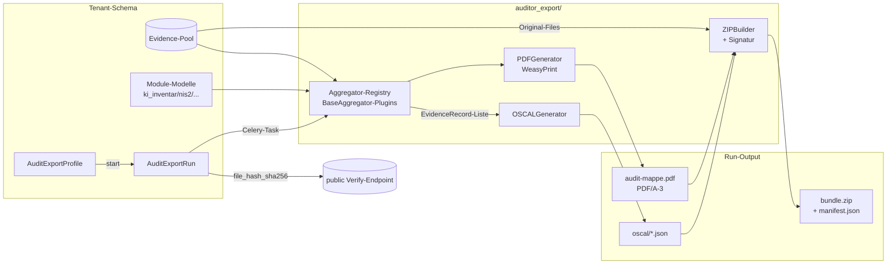

# Spec — Auditor-Export: OSCAL + PDF-Sammelmappe + ZIP-Beweismappe

**Datum:** 2026-05-17
**Status:** Draft (wartet auf User-Review)
**Phase:** 3 (nach Phase-1.5 Onboarding/AI-Inventar/Datenpannen/AVV/NIS2 abgeschlossen)
**Vorgänger:** `2026-04-24-mvp-architecture-design.md`, `2026-05-16-eigene-kurse-design.md`, `2026-05-16-feature-improvements-design.md`
**Scope:** Generischer, modul-übergreifender Audit-Export, Datenformate OSCAL-JSON + PDF/A-3 + ZIP-Bundle, Frontend-Wizard, Verify-Endpoint.
**Out of Scope:** Inhaltliche Norm-Kataloge (eigene Catalog-Files), GRC-Vollausbau (Risikoregister, KRIs), externes Auditor-Portal mit Login, automatisierte Behörden-Übermittlung (BfDI/BSI-API), Long-Term-Validation-Signatur (PAdES-LTV).

---

## 1. Motivation und Zielmoment

### Status quo
Vaeren erhebt heute Evidence in jedem Modul:
- `core.Evidence` ist das gemeinsame Anker-Modell (immutable, SHA-256, MIME, Größe, `bezug_task`)
- `pflichtunterweisung` produziert Zertifikate (WeasyPrint, `pdf.py`), Welle-Snapshots, Quiz-Antworten
- `hinschg` führt verschlüsselte Meldungen + Bearbeitungsschritte
- `datenpannen` führt Pannen + Maßnahmen
- `ki_inventar` führt KI-Tools mit Risiko-Klassifizierung
- `auftragsverarbeitung` führt AVV-Verträge + Verarbeitungsschritte
- `nis2` führt Betroffenheits-Checks, Assets, KontrollAntworten
- `transparenzregister` führt Stammblatt + wirtschaftlich Berechtigte

Was fehlt: **eine prüfungsfähige Gesamt-Ansicht** auf Knopfdruck. Heute müsste der Tenant manuell aus jedem Modul exportieren und händisch zu einer Mappe zusammenstellen.

### Zielmoment
GF/Compliance-Beauftragter steht abends vor dem ISO-27001-Auditor-Termin am nächsten Morgen. Er öffnet `app.vaeren.de/audit-export`, wählt das **Template** „ISO-27001 Annex-A Audit", **Norm-Scope** „ISO-27001 + AVV + Pflichtunterweisung", **Zeitraum** „letzte 12 Monate", klickt **Generieren** → 4–8 Minuten später lädt er ein ZIP herunter, das alles enthält, was der Auditor sehen will. Eindeutige Mappe-ID + QR-Code + Verify-Endpoint beweisen Authentizität.

### Hauptwert
1. **Audit-Stress eliminieren** — keine Excel-Tabellen zusammenkleben, keine Screenshots, keine Mail-Anhänge.
2. **Interoperabilität** — OSCAL-JSON ist ein offener NIST-Standard und wird zunehmend von Auditoren akzeptiert (insbesondere bei NIS2/DORA-Pflichtigen).
3. **Manipulations-Schutz** — Hash-Chain + Signatur + Verify-Endpoint beweisen, dass die Mappe authentisch ist.
4. **Differenzierung** — kein KMU-Wettbewerber bietet OSCAL-Export. Verkaufsargument bei größeren Pilot-Kunden.

---

## 2. Vertikales Slicing

Acht Slices, jeder einzeln deploy-bar (Feature-Completion-Discipline aus `CLAUDE.md`).

| # | Slice | Mehrwert nach Deploy |
|---|---|---|
| S1 | Profile + Run-Backend | Tenant kann Export-Profile anlegen (Norm-Scope, Zeitraum, Template, Inhalts-Optionen) und einen Run starten — produziert noch nichts außer Audit-Log. |
| S2 | Cross-Module-Aggregatoren | Run sammelt Evidence-Records aus allen Modulen über `BaseAggregator`-Plugin-Pattern; Generation-Log zeigt Counts. Noch keine Outputs. |
| S3 | OSCAL-Generator | Run produziert `assessment-results.json` + `system-security-plan.json` nach NIST-OSCAL-1.1.2 mit `oscal-pydantic`-Modellen. Download-Button. |
| S4 | PDF-Sammelmappe (WeasyPrint) | Run produziert PDF/A-3 mit Deckblatt, Inhaltsverzeichnis, Control-Detail-Seiten, Anhängen. |
| S5 | ZIP-Bundle + Signatur | Run produziert ZIP mit `/manifest.json` + Signatur. Per-Tenant-Signing-Key. Streaming. |
| S6 | Verify-Endpoint (public) | Externer Auditor pastet File-Hash auf `vaeren.de/verify` → bestätigt Authentizität. |
| S7 | Templates + Norm-Catalogs | Sechs Audit-Templates + drei Norm-Catalogs (ISO-27001 Annex-A, NIS2 Art. 21, AI-Act Annex-III) ausgeliefert. |
| S8 | Frontend-Wizard + Run-Detail | UI 5-Step-Wizard, Run-Liste, Run-Detail mit Generation-Log + Download-Buttons. |

**Aus dem MVP-Scope ausgeschlossen:**
- Bearbeitbare Norm-Catalog-Editor im UI (Phase 4 — Catalogs sind erstmal nur YAML-Dateien im Repo).
- Vergleich „letzter Run vs. dieser Run" / Diff-View.
- Inkrementelle Exporte (nur Full-Exports im MVP).
- S3-Storage. Bleibt lokales Volume `vaeren-media/audit-export/`. Migrationspfad in §11.
- Cross-Tenant-Aggregation für Konzern-Strukturen (ein Run = ein Tenant).
- Echte digitale Signatur (eIDAS-konform, X.509). MVP nutzt HMAC-SHA256, Spec §8 begründet.

---

## 3. Architektur-Übersicht

### 3.1 Datenfluss



### 3.2 Komponenten-Verantwortung

| Komponente | Verantwortung |
|---|---|
| `auditor_export/models.py` | `AuditExportProfile`, `AuditExportRun`, `AuditExportCatalog` (Norm-Definitionen) |
| `auditor_export/aggregators/_base.py` | `BaseAggregator` ABC + Registry |
| `auditor_export/aggregators/<modul>.py` | Pro Modul ein Aggregator (KIInventarAggregator, HinSchGAggregator, …) |
| `auditor_export/oscal.py` | OSCAL-Pydantic-Models + Mapping-Service |
| `auditor_export/pdf.py` | PDF-Generator analog `pflichtunterweisung/pdf.py` |
| `auditor_export/zip_builder.py` | Bundle-Builder, Manifest-Erzeugung, HMAC-Signatur |
| `auditor_export/tasks.py` | Celery-Task `run_export(run_id)` |
| `auditor_export/views.py` | DRF-ViewSets für Profile/Run + Verify-Endpoint (public) |
| `auditor_export/templates/` | Jinja/Django-Templates für PDF (Deckblatt, Index, Control-Seite) |
| `auditor_export/catalogs/*.yaml` | Norm-Kataloge (ISO-27001-Annex-A.yaml, NIS2-Art21.yaml, AI-Act-AnnexIII.yaml) |

### 3.3 Cross-Module-Kontrakt

Die Aggregatoren sind die einzige Schnittstelle vom Audit-Export-Modul in die Domain-Module. Keine direkten `from ki_inventar.models import KITool`-Imports im OSCAL-/PDF-/ZIP-Code — alles geht durch das `EvidenceRecord`-Datatransfer-Objekt. Damit bleibt die Domain-Boundary-Regel aus `CLAUDE.md` §Coding-Konventionen gewahrt.

---

## 4. Datenmodell

Alle Änderungen liegen in `backend/auditor_export/models.py` + Erweiterung von `backend/tenants/models.py::Tenant`.

### 4.1 `Tenant` — neues Feld

```python
class Tenant(TenantMixin):
    ...
    audit_signing_key = models.BinaryField(
        editable=False,
        default=b"",
        help_text=(
            "HMAC-SHA256-Schlüssel für Audit-Export-Manifeste. Auto-generiert in save()."
            " Strikt getrennt vom HinSchG-encryption_key — Rotation hier ist erlaubt"
            " (alte Mappen behalten ihre Signatur, neue werden mit neuem Key signiert)."
        ),
    )

    def save(self, *args, **kwargs):
        if not self.encryption_key:
            self.encryption_key = Fernet.generate_key()
        if not self.audit_signing_key:
            self.audit_signing_key = secrets.token_bytes(32)
        super().save(*args, **kwargs)
```

**Begründung getrennter Key:** Würden wir den `encryption_key` für die Signatur nutzen, hätte ein Leak des Signing-Logs (z.B. via Logging-Bug) das Risiko, den HinSchG-Decryption-Key zu enthüllen. Strikte Key-Separation ist Standard-Krypto-Hygiene.

### 4.2 `AuditExportProfile`

```python
class NormScope(models.TextChoices):
    ISO_27001 = "iso_27001", "ISO/IEC 27001"
    ISO_42001 = "iso_42001", "ISO/IEC 42001 (KI-Managementsystem)"
    NIS2 = "nis2", "NIS2-Richtlinie"
    DSGVO = "dsgvo", "DSGVO"
    AI_ACT = "ai_act", "EU AI Act"
    ARBEITSSCHUTZ = "arbeitsschutz", "Arbeitsschutz (DGUV)"
    PFLICHTUNTERWEISUNG = "pflichtunterweisung", "Pflichtunterweisungen"
    HINSCHG = "hinschg", "Hinweisgeberschutzgesetz"
    AVV = "avv", "Auftragsverarbeitungs-Verträge"


class EvidenceMode(models.TextChoices):
    EMBED = "embed", "Originalfiles im ZIP einbetten"
    REFERENCE = "reference", "Nur Hash-Referenzen (kleinere Bundle-Größe)"


class AuditExportProfile(models.Model):
    """Wiederverwendbare Konfiguration für einen Export-Lauf."""

    name = models.CharField(max_length=200)
    template = models.CharField(max_length=50, help_text="Siehe AUDIT_TEMPLATES-Registry")
    norm_scope = models.JSONField(
        default=list,
        help_text="Liste von NormScope-Strings, M:N als JSON-Array",
    )
    zeitraum_von = models.DateField()
    zeitraum_bis = models.DateField()
    filter_json = models.JSONField(
        default=dict,
        blank=True,
        help_text="Pro Modul Sub-Filter, z.B. {'hinschg': {'status': ['neu', 'in_pruefung']}}",
    )
    evidence_mode = models.CharField(
        max_length=20, choices=EvidenceMode.choices, default=EvidenceMode.EMBED
    )
    anonymisieren_pii = models.BooleanField(
        default=False,
        help_text="Wenn True: Mitarbeiter-Namen werden zu MA-001/MA-002 maskiert.",
    )
    watermark_draft = models.BooleanField(
        default=False, help_text="DRAFT-Wasserzeichen im PDF"
    )
    erstellt_von = models.ForeignKey("core.User", on_delete=models.SET_NULL, null=True)
    erstellt_am = models.DateTimeField(auto_now_add=True)
    aktualisiert_am = models.DateTimeField(auto_now=True)

    class Meta:
        ordering = ["-aktualisiert_am"]
```

### 4.3 `AuditExportRun`

```python
class ExportRunStatus(models.TextChoices):
    QUEUED = "queued", "Eingereiht"
    RUNNING = "running", "Läuft"
    DONE = "done", "Fertig"
    FAILED = "failed", "Fehlgeschlagen"
    CANCELLED = "cancelled", "Abgebrochen"


class AuditExportRun(models.Model):
    profile = models.ForeignKey(AuditExportProfile, on_delete=models.PROTECT, related_name="runs")
    started_by = models.ForeignKey("core.User", on_delete=models.SET_NULL, null=True)
    started_at = models.DateTimeField(auto_now_add=True)
    finished_at = models.DateTimeField(null=True, blank=True)
    status = models.CharField(max_length=20, choices=ExportRunStatus.choices, default=ExportRunStatus.QUEUED)
    result_path = models.CharField(max_length=512, blank=True, default="")
    file_hash_sha256 = models.CharField(max_length=64, blank=True, default="", db_index=True)
    file_size_bytes = models.PositiveBigIntegerField(default=0)
    evidence_count = models.PositiveIntegerField(default=0)
    generation_log = models.JSONField(
        default=list,
        help_text="Liste von {ts, level, aggregator, message}-Einträgen für Run-Detail-Anzeige",
    )
    error = models.TextField(blank=True, default="")
    mappe_id = models.CharField(
        max_length=20,
        unique=True,
        help_text="Menschen-lesbare Run-ID, Format VAE-2026-XXXX-YYYY",
    )

    class Meta:
        ordering = ["-started_at"]
        indexes = [models.Index(fields=["status", "-started_at"])]
```

### 4.4 `AuditExportCatalog` (referenziell, Read-only)

```python
class AuditExportCatalog(models.Model):
    """Liest YAML-Catalog-Files aus auditor_export/catalogs/ einmalig in DB.
    Vorteil: keine YAML-Reads zur Run-Zeit, OSCAL-Mapping als FK referenzierbar.
    """
    slug = models.CharField(max_length=50, unique=True)
    titel = models.CharField(max_length=200)
    norm = models.CharField(max_length=50, choices=NormScope.choices)
    version = models.CharField(max_length=20)
    controls_json = models.JSONField()
    geladen_am = models.DateTimeField(auto_now=True)
```

YAML-Beispiel `catalogs/iso-27001-annex-a.yaml`:

```yaml
slug: iso-27001-annex-a-2022
titel: ISO/IEC 27001:2022 Annex A
norm: iso_27001
version: "2022"
controls:
  - id: A.5.1
    titel: Informationssicherheits-Richtlinien
    oscal_control_id: iso-27001-a.5.1
    vaeren_module_evidence:
      - module: nis2
        kontroll_typ: governance
      - module: auftragsverarbeitung
        kontroll_typ: vertrag
  - id: A.5.2
    titel: Rollen und Verantwortlichkeiten
    ...
```

### 4.5 Migrations-Plan

Eine einzige Migration pro Slice. Slice S1 erstellt `AuditExportProfile`, `AuditExportRun`, `AuditExportCatalog` und das `Tenant.audit_signing_key`-Feld (public schema). Backfill-Datenmigration im `RunPython`: bestehende Tenants bekommen einen Signing-Key generiert (idempotent).

---

## 5. Cross-Module-Aggregatoren

### 5.1 `BaseAggregator`-Interface

```python
# auditor_export/aggregators/_base.py

@dataclass(frozen=True)
class EvidenceRecord:
    """DTO. Modul-agnostische Repräsentation eines Audit-Beleg-Eintrags."""
    aggregator_slug: str            # "ki_inventar", "hinschg", ...
    record_id: str                  # eindeutig im Aggregator, z.B. "KITool:42"
    titel: str
    beschreibung: str
    erstellt_am: datetime
    verantwortlicher_email: str | None
    status: str                     # "erledigt", "offen", ...
    evidence_files: list["EvidenceFileRef"]
    oscal_control_ids: list[str]
    raw_data: dict                  # voll-strukturiert für PDF/OSCAL


@dataclass(frozen=True)
class EvidenceFileRef:
    filename: str
    sha256: str
    mime_type: str
    size_bytes: int
    absolute_path: str | None       # None wenn nur in DB als Reference
    encrypted: bool                 # HinSchG-Bodies sind verschlüsselt


class BaseAggregator(abc.ABC):
    slug: str
    norm_scopes: list[NormScope]    # zu welchen Norm-Scopes liefert dieser Aggregator?

    @abc.abstractmethod
    def collect(self, *, period_from: date, period_to: date, filter_dict: dict) -> Iterable[EvidenceRecord]:
        ...

    @abc.abstractmethod
    def map_to_oscal(self, record: EvidenceRecord) -> "OscalObservation":
        ...

    def filter_rdg_safe(self, record: EvidenceRecord) -> bool:
        """RDG-Schutz: Records mit LLM-generierten Vorschlägen ohne menschliche
        Bestätigung dürfen NICHT in den Auditor-Export. Default-Impl prüft auf
        raw_data.get('llm_draft') is True — Unter-Klassen können verfeinern.
        """
        return not record.raw_data.get("llm_draft", False)
```

**RDG-Filter-Pflicht:** Spec-Regel aus `CLAUDE.md` § Nicht-verhandelbare Architektur-Regeln:1. Beispiele:
- `ki_inventar.KITool.risiko_klasse` ist `draft` solange GF noch nicht bestätigt hat → ausgefiltert
- `datenpannen.Datenpanne.risiko_einschaetzung_llm_vorschlag` (Feld-Name aus Modul) bleibt im DB-Datensatz, wird aber nur dann exportiert wenn der menschlich-bestätigte Wert `risiko_einschaetzung` gesetzt ist
- `hinschg.Meldung`-Body wird NIE LLM-bewertet, gilt also als sicher
- Aggregator-Spezifische Verfeinerung in den Subklassen (`KIInventarAggregator.filter_rdg_safe` prüft zusätzlich `tool.status != KIToolStatus.DRAFT`)

### 5.2 Aggregator-Registry

```python
# auditor_export/aggregators/__init__.py
from .ki_inventar import KIInventarAggregator
from .hinschg import HinSchGAggregator
from .datenpannen import DatenpannenAggregator
from .auftragsverarbeitung import AVVAggregator
from .nis2 import NIS2Aggregator
from .transparenzregister import TransparenzregisterAggregator
from .pflichtunterweisung import PflichtunterweisungAggregator

AGGREGATORS = {a.slug: a for a in [
    KIInventarAggregator(),
    HinSchGAggregator(),
    DatenpannenAggregator(),
    AVVAggregator(),
    NIS2Aggregator(),
    TransparenzregisterAggregator(),
    PflichtunterweisungAggregator(),
]}
```

Pattern direkt aus `panels/_base.py` von paywise-dashboard inspiriert (Plugin + Registry), aber als eigener Code in Vaeren — kein Import von paywise.

### 5.3 Aggregator-Inventar

| Slug | Datenquelle | Hauptevidenz | OSCAL-Mapping |
|---|---|---|---|
| `ki_inventar` | `KITool` (status≠draft) | KI-Tool-Steckbrief, Risiko-Klasse, Datenquellen | AI-Act-Anhang-III.* + ISO-42001.* |
| `hinschg` | `Meldung` + `Bearbeitungsschritt` | Anonymisierter Auszug (Body bleibt encrypted im ZIP), Fristen-Status | HinSchG.§13 + ISO-27001.A.5.4 |
| `datenpannen` | `Datenpanne` + `Massnahme` | 72h-Meldungs-Beleg, Maßnahmen-Status | DSGVO.Art.33, ISO-27001.A.5.24 |
| `auftragsverarbeitung` | `Auftragsverarbeiter` + `Verarbeitungsschritt` | AVV-Vertrag, Drittland-Status | DSGVO.Art.28, ISO-27001.A.5.20 |
| `nis2` | `BetroffenheitsCheck`, `Asset`, `KontrollAntwort` | Maturity-Score je Kontroll-Domäne | NIS2-Art.21, ISO-27001.* |
| `transparenzregister` | `Unternehmensstammblatt`, `WirtschaftlichBerechtigter` | GwG-Pflichten-Check | GwG.§3 |
| `pflichtunterweisung` | `Kurs`, `SchulungsWelle`, `SchulungsTask` (bestanden) | Zertifikat-PDF (Snapshot), Quiz-Ergebnis | DGUV-V1, ISO-27001.A.6.3 |

Jeder Aggregator wendet aktiv `filter_rdg_safe()` an, bevor er Records yieldet — RDG-Verstoß durch Aggregator-Bug ist CI-getestet (siehe §10).

---

## 6. OSCAL-Generator

### 6.1 Lib-Wahl: oscal-pydantic vs. eigene Models

**Entscheidung:** Eigene pydantic-Models in `auditor_export/oscal.py` schreiben, NICHT `oscal-pydantic` als Dependency aufnehmen.

**Begründung:**
| Kriterium | oscal-pydantic | Eigene Models |
|---|---|---|
| Vollständigkeit OSCAL 1.1.2 | komplett (alle Layers) | nur was wir brauchen (~30 % der Spec) |
| Aktualität auf PyPI | aktiv (letzter Release < 6 Monate) | wir kontrollieren |
| Anhängigkeit | + ~50 weitere pydantic-Models | 0 Extra-Deps |
| Lock-in | mittel (Schema-Drift bei Upstream-Updates) | keine |
| Kontrolle Field-Aliase | begrenzt | voll |
| Build-Zeit | + 1–2 s Import | minimal |
| Solo-Builder-Wartbarkeit | Konrad muss fremden Code lesen | Konrad schreibt selbst |

Da Vaeren nur einen Lese-Schreib-Pfad braucht (Schema-Validierung beim Test, kein Schema-Roundtrip), und der OSCAL-Subset für unsere Norm-Mappings überschaubar ist (~200 Zeilen pydantic), überwiegt der Kontroll-Vorteil. Zusätzlich gibt es ein hartes Sub-Argument: bei einem Schema-Bug in `oscal-pydantic` (passiert in jeder Lib) müssten wir entweder warten oder forken — beides ist Solo-Builder-feindlich. Eigene Models sind 2 h Schreibarbeit und dann gelöst.

Begleitend: wir validieren unsere generierten JSON-Dateien gegen die offiziellen OSCAL-JSON-Schemas (Download in CI, JSON-Schema-Validation als Test-Step). Damit halten wir Konformität ohne die Lib-Dependency.

### 6.2 Generierte Artefakte

Zwei JSON-Dateien pro Run:

**`oscal/system-security-plan.json`** — beschreibt unser System (=Tenant):
- `metadata`: Tenant-Name, Generierungs-Zeitstempel, Mappe-ID, Vaeren-Version
- `system-characteristics`: Tenant-Identifier, Information-Types (HinSchG, Personalakten, etc.)
- `system-implementation`: Components (= unsere Module + Sub-Komponenten)
- `control-implementation`: pro Norm-Control welche Vaeren-Komponente Evidence liefert

**`oscal/assessment-results.json`** — beschreibt den Audit-Lauf:
- `metadata`: Run-Daten, Profile-Referenz
- `results`: pro Norm-Catalog eine `result`-Section, darin Observations (1:1 zu Aggregator-Records) + Findings (Coverage-Lücken: Controls ohne Evidence)

### 6.3 Mapping Vaeren → OSCAL

Beispiel HinSchG-Aggregator → OSCAL:

```python
def map_to_oscal(self, record: EvidenceRecord) -> OscalObservation:
    return OscalObservation(
        uuid=stable_uuid_v5(record.record_id),
        title=f"Hinweisgeberfall {record.record_id}",
        description=record.beschreibung,
        methods=["INTERVIEW", "EXAMINE"],
        types=["finding"],
        subjects=[OscalSubjectReference(
            subject_uuid=stable_uuid_v5(f"vaeren.tenant.{tenant_schema}"),
            type="component",
        )],
        relevant_evidence=[
            OscalEvidence(
                href=f"evidence/hinschg/{record.record_id}/{f.filename}",
                description=f"SHA-256: {f.sha256}",
            )
            for f in record.evidence_files
        ],
        collected=record.erstellt_am.isoformat(),
        props=[
            {"name": "vaeren-control-id", "value": cid}
            for cid in record.oscal_control_ids
        ],
    )
```

### 6.4 UUID-Stabilität

OSCAL braucht UUIDs in vielen Feldern. Wir verwenden **UUID-v5** mit Vaeren-Namespace-UUID (`12345678-1234-5678-1234-567812345678`, fixiert in Code) + record-Identifier-String. Damit ist die gleiche Mappe bei wiederholtem Lauf bit-identisch (Voraussetzung für Snapshot-Tests, §10).

---

## 7. PDF-Sammelmappe

### 7.1 Lib

WeasyPrint analog `pflichtunterweisung/pdf.py`. Lazy import + graceful Fallback wenn libcairo/libpango fehlt (CI-Test ohne System-Libs).

### 7.2 PDF/A-3-Konformität — warum

PDF/A-3 ist der ISO-19005-3-Standard für archivierungsfähiges PDF. Anders als PDF/A-2 erlaubt es eingebettete Anhänge beliebiger Formate (z.B. unsere OSCAL-JSON-Dateien können ALS PDF-Anhang im PDF/A-3 mitfliegen).

**Warum für Audit-Mappen relevant:**
1. **Behörden-Anforderung** — BfDI / BSI nehmen bevorzugt PDF/A entgegen, NIS2-Aufsicht zunehmend ebenso.
2. **Selbstständige Authentizität** — alles in einer Datei statt ZIP zerlegen müssen.
3. **10-Jahre-Aufbewahrungs-Pflicht** — Audit-Belege fallen unter HGB-§257 (10 J). PDF/A garantiert Lesbarkeit in 10+ Jahren.

WeasyPrint kann PDF/A-3 seit v60 via `--pdf-variant pdf/a-3b`. Wir setzen das aktiv. Fonts werden eingebettet (CSS `@font-face` mit lokalen `.ttf`-Files in `auditor_export/static/fonts/`).

### 7.3 Layout

```mermaid
flowchart TD
    Cover[Deckblatt:<br/>Logo, Tenant, Norm-Scope, Zeitraum, Mappe-ID, QR-Code, Verify-URL]
    TOC[Inhaltsverzeichnis hierarchisch<br/>1. Geltungsbereich<br/>2. Pro Norm: Coverage<br/>3. Controls<br/>4. Audit-Log-Summary<br/>5. Anhänge]
    Geltung[1. Geltungsbereich:<br/>Tenant-Stammdaten<br/>Generierungs-Daten<br/>Profile-Konfiguration<br/>RDG-Hinweis (siehe 7.5)]
    NormA[2. Norm A — ISO 27001 Annex A]
    NormACov[Coverage-Score Donut<br/>Pro Domain Anzahl Controls<br/>Implementiert/Teilweise/Offen]
    NormACtrl[Pro Control:<br/>ID + Titel<br/>Status + Verantwortlicher<br/>Evidence-Refs als Tabelle<br/>Verlinkt zu Anhang]
    Audit[4. Audit-Log-Summary:<br/>Hash-Chain-Übersicht<br/>Letzte X Monate kritische Events]
    App[5. Anhänge:<br/>Pro Evidence-File entweder<br/>eingebettet (PDF/Bild) oder<br/>als Hash-Referenz mit Pfad im ZIP]
    End[Schluss-Seite:<br/>Generierungs-Meta<br/>Signatur-Block<br/>Verify-Anleitung]

    Cover --> TOC --> Geltung --> NormA --> NormACov --> NormACtrl --> Audit --> App --> End
```

### 7.4 Hash-Chain für Audit-Log-Summary

Manipulationsschutz für den Audit-Log-Auszug am Ende der Mappe:

1. Aggregator sammelt `AuditLog`-Einträge im Zeitraum, sortiert nach `timestamp`.
2. Wir berechnen pro Eintrag einen `chain_hash = SHA256(prev_chain_hash || sha256(entry_json))`.
3. Der finale `chain_hash` landet auf der Schluss-Seite des PDFs UND im `manifest.json`.
4. Auditor kann unabhängig nachrechnen (Anleitung in der Mappe).

Limitation: Das ist KEIN Tamper-Proof gegen Vaeren-Insider (wir generieren das Log und könnten es vor dem Hashen manipulieren). Für echten Tamper-Proof gegen Vaeren bräuchten wir Third-Party-Notarisierung (z.B. RFC-3161-Timestamp-Authority oder Blockchain-Anchoring). MVP-Begründung: für KMU-Auditor-Use-Cases reicht die Self-Consistency; der ISO-Auditor prüft Manipulation gegen Vaeren nicht.

### 7.5 RDG-Hinweis-Block

Auf Seite 2 der Mappe (Geltungsbereich-Abschnitt) ein verpflichtender Hinweis:

> Diese Mappe enthält ausschließlich menschlich bestätigte Daten. Vom KI-Modul der Vaeren-Plattform erzeugte Risiko-Vorschläge sind erst nach Bestätigung durch verantwortliche Personen Bestandteil dieses Exports. Vaeren ist keine Rechtsdienstleistung im Sinne des RDG und ersetzt keine juristische Prüfung.

Statisch im Template. Nicht abschaltbar. Ist Teil der RDG-Schutz-Schicht.

### 7.6 Anonymisierung

`AuditExportProfile.anonymisieren_pii=True`:
- Mitarbeiter-Namen werden zu Pseudo-IDs (`MA-001`, `MA-002`, …) pro Run stabil
- Eine Mapping-Tabelle (`ma_mapping.csv`) wird verschlüsselt mit dem AVV-Schlüssel des Tenants und nur als TXT-Hinweis im ZIP gehalten — nicht im PDF
- HinSchG-Bodies sind ohnehin verschlüsselt; im anonymisierten Modus bleiben sie im Bundle als `encrypted=true` markiert und nicht entschlüsselt

### 7.7 Wasserzeichen

`watermark_draft=True`: CSS-Wasserzeichen via diagonal positioniertes `<div>` mit opacity 0.15 auf jeder Seite. Text `ENTWURF — NICHT FÜR EXTERNE WEITERGABE`.

---

## 8. ZIP-Bundle + Signatur

### 8.1 Bundle-Layout

```
audit-mappe-<MAPPE_ID>.zip
├── manifest.json
├── audit-mappe.pdf            (PDF/A-3, alle Sektionen)
├── oscal/
│   ├── system-security-plan.json
│   └── assessment-results.json
├── evidence/
│   ├── ki_inventar/
│   │   ├── KITool-42/
│   │   │   ├── steckbrief.json
│   │   │   └── modellkarte.pdf      (Original-Upload)
│   │   └── ...
│   ├── hinschg/
│   │   └── Meldung-12/
│   │       ├── meldung-redacted.json
│   │       └── body.enc              (encrypted bleibt encrypted!)
│   └── ...
├── audit-log-chain.csv         (für die Hash-Chain-Verifikation)
└── README.txt                  (Auditor-Anleitung, Verify-URL)
```

### 8.2 `manifest.json` Schema

```json
{
  "mappe_id": "VAE-2026-0517-A3F2",
  "generated_at": "2026-05-17T18:42:11Z",
  "tenant": "acme_gmbh",
  "vaeren_version": "1.4.2",
  "profile": {
    "name": "ISO-27001 Q1 2026",
    "norm_scope": ["iso_27001", "avv"],
    "zeitraum_von": "2025-05-17",
    "zeitraum_bis": "2026-05-17"
  },
  "files": [
    {"path": "audit-mappe.pdf", "sha256": "...", "size": 1234567},
    {"path": "oscal/system-security-plan.json", "sha256": "...", "size": 12345},
    ...
  ],
  "audit_log_chain_head": "0xabcdef...",
  "signature": {
    "algorithm": "HMAC-SHA256",
    "value": "0x123...",
    "signed_fields": ["mappe_id", "generated_at", "tenant", "files", "audit_log_chain_head"]
  }
}
```

### 8.3 Signatur-Verfahren

**Algorithmus:** HMAC-SHA256.

**Schlüssel:** `Tenant.audit_signing_key` (32 Bytes, im `BinaryField`).

**Signed-Bytes:** kanonisches JSON der signed_fields-Liste (sorted keys, no whitespace), encoded UTF-8. Implementation in `zip_builder.py::sign_manifest()`.

**Warum HMAC und nicht echte Digital Signature?**
| Kriterium | HMAC-SHA256 | RSA/ECDSA + X.509 |
|---|---|---|
| Verifikation extern | nur via Vaeren-Endpoint | mit jedem PKI-Client |
| eIDAS-konform | nein | mit qualifiziertem Zertifikat ja |
| Key-Management | Tenant-Key in DB | HSM oder PKCS#11 |
| Implementations-Aufwand | ~20 Zeilen Code | + Cert-Service + Renewal + CA-Vertrauenskette |
| Pilot-Kunde-Anforderung 2026 | erfüllt | überspezifiziert |

Wir akzeptieren das Trade-off bewusst: HMAC reicht für „Vaeren bestätigt Authentizität dieser Mappe gegenüber dem Auditor" via Verify-Endpoint. Wenn ein Pilot-Kunde explizit eIDAS-QES für Audit-Reports fordert (DORA-relevant, Finanzdienstleister), wechseln wir auf S/MIME-Signatur in Phase 4. Spec-Ausgang dann eigener.

### 8.4 Verify-Endpoint

Öffentliche Route (kein Tenant-Schema-Context, public-Schema):

```
POST https://vaeren.de/verify
{ "mappe_id": "VAE-2026-0517-A3F2", "file_sha256": "abc..." }
→ 200 { "verified": true, "tenant": "acme_gmbh", "generated_at": "...", "norm_scope": [...] }
→ 200 { "verified": false, "reason": "hash_mismatch" }
→ 404 { "verified": false, "reason": "mappe_unknown" }
```

Implementation: Lookup in `public_schema.audit_export_run_index` (denormalisierte Read-View, beschrieben in §11.2), HMAC-Recompute mit dem zugehörigen Tenant-Signing-Key, Constant-Time-Compare.

**Privacy-Hinweis:** Verify gibt KEINE PII zurück — nur Tenant-Schema-Name (= bewusst gewählter Bezeichner, idR Firmenname-Slug) und Norm-Scope. Body-Inhalt der Mappe wird nicht offengelegt.

### 8.5 Streaming

Für 1000+ Evidence-Records ist In-Memory-ZIP-Bauen nicht akzeptabel. Verwendung:

- **WeasyPrint** kann `write_pdf(target=stream)` direkt in einen `BytesIO` / `open(..., 'wb')`-Stream.
- **zipfile.ZipFile** in `'w'`-Mode mit `zipfile.ZIP_DEFLATED` schreibt streaming.
- Evidence-Files werden mit `shutil.copyfileobj` gestreamt (4 KB Chunks) — kein Full-Load in Memory.
- Bei `evidence_count > 500`: wir splitten die ZIP in Chunks von 500 MB max — `audit-mappe-<MAPPE_ID>-part1.zip`, …

Tests verifizieren Memory-Footprint mit `tracemalloc` < 200 MB für 1000-Evidence-Szenario.

---

## 9. Templates

### 9.1 Template-Registry

`auditor_export/templates_registry.py`:

```python
AUDIT_TEMPLATES = {
    "iso_27001_audit": {
        "label": "ISO-27001 Annex-A Audit",
        "pdf_template": "auditor_export/iso_27001_audit.html",
        "default_norm_scope": ["iso_27001", "avv", "hinschg"],
        "include_audit_log_summary": True,
    },
    "gap_analyse": {
        "label": "GAP-Analyse (Lücken rot markiert)",
        "pdf_template": "auditor_export/gap_analyse.html",
        "default_norm_scope": ["iso_27001", "nis2", "ai_act", "dsgvo"],
        "highlight_missing": True,
    },
    "tisax_light": {
        "label": "TISAX-Light (Automotive-Zulieferer)",
        "pdf_template": "auditor_export/tisax_light.html",
        "default_norm_scope": ["iso_27001", "avv"],
    },
    "ai_act_konformitaet": {
        "label": "AI-Act Konformitätsbericht",
        "pdf_template": "auditor_export/ai_act.html",
        "default_norm_scope": ["ai_act", "iso_42001"],
    },
    "nis2_behoerden_vorlage": {
        "label": "NIS2 Behörden-Vorlage (BSI)",
        "pdf_template": "auditor_export/nis2_bsi.html",
        "default_norm_scope": ["nis2"],
    },
    "bfdi_template": {
        "label": "BfDI/LDA Datenschutz-Anfrage",
        "pdf_template": "auditor_export/bfdi.html",
        "default_norm_scope": ["dsgvo", "avv", "datenpannen"],
    },
    "geschaeftsfuehrer_mappe": {
        "label": "GF-Mappe (kurz, Executive Summary)",
        "pdf_template": "auditor_export/gf_kurz.html",
        "max_pages": 20,
        "default_norm_scope": ["iso_27001", "nis2", "dsgvo", "ai_act"],
        "executive_summary_only": True,
    },
}
```

### 9.2 Template-Erweiterungspunkte

Templates können von Catalog-Files abhängige Sektionen rendern, indem sie `` über die selektierten Catalogs iterieren. Damit ist die Hinzunahme neuer Norm-Kataloge (z.B. ISO-42001-Annex-A oder DORA-RTS) ohne Template-Änderung möglich — neue YAML-Datei in `catalogs/` + DB-Reload genügt.

---

## 10. Tests

### 10.1 Coverage-Ziele

| Layer | Test-Typ | Mindest-Coverage | Wo |
|---|---|---|---|
| Aggregatoren | pytest-django, jeder Aggregator mit Demo-Tenant-Fixture | 95 % | `backend/auditor_export/tests/test_aggregators.py` |
| OSCAL-Generator | Schema-Validierung gegen offizielle OSCAL-JSON-Schemas | 90 % | `backend/auditor_export/tests/test_oscal.py` |
| PDF-Generator | Snapshot-Test gegen SHA-256 von rendered HTML (nicht PDF — PDF ist nicht determ.); PDF-Smoke nur wenn libcairo verfügbar (CI-Job „pdf-smoke") | 85 % | `backend/auditor_export/tests/test_pdf.py` |
| ZIP-Builder | Streamings-Memory-Test, Manifest-Signatur, Roundtrip-Verifikation | 95 % | `backend/auditor_export/tests/test_zip.py` |
| Verify-Endpoint | Public-Schema-Test, korrekte Tenant-Disclosure | 95 % | `backend/auditor_export/tests/test_verify.py` |
| RDG-Filter | Test pro Aggregator: LLM-Draft-Record landet NICHT im Export. CI-Gate. | 100 % | `backend/auditor_export/tests/test_rdg_filter.py` |
| End-to-end Run | Demo-Tenant aus seed_data → Run → ZIP-Verifikation → OSCAL-Schema-Validierung | 1 Test reicht | `backend/auditor_export/tests/test_run_e2e.py` |

Gesamt-Modul-Coverage-Gate: `--cov-fail-under=85` (höher als Sprint-7-Baseline 80 % wegen Sicherheitsrelevanz).

### 10.2 Anti-Patterns (Spec-Pflicht)

- Keine echten OSCAL-Cloud-API-Calls (gibt es nicht). Schema-Files liegen lokal in `tests/fixtures/oscal-schemas/`.
- Keine echten WeasyPrint-Renderings in normalem CI-Job (System-Lib-Pflicht). Smoke-Render nur im optionalen pdf-smoke-Job.
- Keine echten Filesystem-ZIP-Generierungen — `pyfakefs` oder `tmp_path` für ZIP-Tests.
- Keine Snapshot-Tests gegen rendered PDFs (Binary, nicht deterministisch ohne Reproducible-Build-Flag).

### 10.3 Multi-Tenant-Isolations-Test (CI-Gate)

Pflicht: Ein Test legt zwei Tenants A und B an, generiert in A einen Run, prüft dass:
1. Run von B aus ist NICHT abrufbar via API.
2. Manifest enthält NUR A-Evidence.
3. Cross-Tenant-Verify-Endpoint-Call (Hash von A, mit B-Token authentifiziert) erkennt korrekt: `tenant != current_tenant`, gibt 404 zurück.

### 10.4 RDG-Layer-3-Test

Setup: Datenpanne mit `risiko_einschaetzung_llm_vorschlag="hoch"` ABER `risiko_einschaetzung=NULL` (= GF noch nicht bestätigt). Test:
- Aggregator `DatenpannenAggregator.collect()` yieldet KEINEN Record für diese Panne, oder yieldet einen Record mit `status="entwurf"` der vom `filter_rdg_safe()` aussortiert wird.
- PDF enthält die Panne nicht.
- OSCAL enthält die Panne nicht.

Failing-this-Test = blocker für Production-Deploy.

---

## 11. Storage und Migration zu S3

### 11.1 MVP-Storage

Lokales Docker-Volume `vaeren-media/audit-export/<tenant_schema>/<run_id>/`. Caddy serves Read-only über `/media/audit-export/...` mit Tenant-Auth-Middleware (analog Pflichtunterweisung-Zertifikat-Download).

### 11.2 Public-Schema-Index für Verify

Da der Verify-Endpoint öffentlich + tenant-unspezifisch ist, brauchen wir einen Public-Schema-Index:

```python
# in tenants/ app
class AuditExportRunIndex(models.Model):
    """Public-Read-Only-Spiegel der wichtigsten Felder zur Verify-Auflösung.
    Wird per signal beim AuditExportRun.save() im Tenant-Schema befüllt
    (tenant_post_save-Signal mit cross-schema-write via schema_context).
    """
    mappe_id = models.CharField(max_length=20, unique=True, db_index=True)
    tenant_schema = models.CharField(max_length=63)
    file_hash_sha256 = models.CharField(max_length=64, db_index=True)
    norm_scope = models.JSONField()
    generated_at = models.DateTimeField()
    # KEIN Inhaltsbezug, kein PII!
```

Cross-Schema-Schreiben passiert in einer einzigen `with schema_context("public"):`-Block-Funktion in `signals.py`.

### 11.3 Migration zu S3 in Phase 4

Wenn lokaler Volume-Footprint > 50 GB:
1. `django-storages[s3]` aktivieren mit Hetzner Object Storage (EU-Frankfurt).
2. `AuditExportRun.result_path` interpretieren als Storage-Backend-Path, nicht Filesystem-Path.
3. Verify-Endpoint bleibt unverändert — Manifest-Lookup geht weiter über Public-Index, File-Download geht via signed URL.

---

## 12. Performance

### 12.1 Ziele

| Szenario | Mappe-Generierung | Bundle-Größe |
|---|---|---|
| 1 MA, 10 Evidence | < 10 s | < 1 MB |
| 100 MA, 1.000 Evidence, embed | < 5 min | 50–300 MB |
| 100 MA, 1.000 Evidence, reference | < 90 s | 2–10 MB |
| 500 MA, 5.000 Evidence, embed | < 20 min | 1–2 GB (split-bundle) |

### 12.2 Strategie

- **Run = Celery-Task** mit `time_limit=1800s, soft_time_limit=1500s`. Bei Soft-Timeout: Run-Status auf `FAILED` mit klarer Meldung „Bundle zu groß — bitte Reference-Mode oder kürzeren Zeitraum".
- **Aggregatoren streamen** via Iterator-Yield, kein Full-List-In-Memory.
- **PDF-Streaming** mit WeasyPrint `write_pdf(target=stream)`.
- **ZIP-Streaming** mit `zipfile.ZipFile`-Append + `shutil.copyfileobj`.
- **DB-N+1-Vermeidung**: jeder Aggregator nutzt `select_related` + `prefetch_related` für seine Hauptqueries. Test mit `django-silk` im Dev-Profil.

### 12.3 Frontend-Polling

Run-Detail-Seite polled `/api/audit-export/runs/<id>/` alle 5 s. Bei `status=running` zeigt Progress-Bar basierend auf `generation_log`-Length / erwartete Anzahl Aggregatoren. Bei `status in [done, failed]`: Polling stoppen.

---

## 13. Frontend (Skizze)

### 13.1 Routen

| Route | Inhalt |
|---|---|
| `/audit-export` | Profile-Liste + Run-Liste der letzten 30 Tage |
| `/audit-export/profile/neu` | Wizard 5-Step |
| `/audit-export/profile/:id` | Profile-Detail + Edit + Run-Start-Button |
| `/audit-export/runs/:id` | Run-Detail mit Generation-Log + Download-Buttons (ZIP/PDF/OSCAL) |
| `/verify` (public, kein Tenant-Context) | Auditor-Verify-Form |

### 13.2 Wizard-Schritte

1. **Name + Zeitraum**: Profile-Name (frei), `zeitraum_von`/`zeitraum_bis` (DateRangePicker, Default „letzte 12 Monate")
2. **Norm-Scope**: Multi-Select-Checkboxen über `NormScope.choices`
3. **Template**: Radio-Buttons über `AUDIT_TEMPLATES`-Registry mit Vorschau-Thumbnail
4. **Inhalts-Optionen**: `evidence_mode` (Radio Embed/Reference), `anonymisieren_pii` (Toggle), `watermark_draft` (Toggle), Filter-JSON-Editor (advanced, optional)
5. **Preview Summary**: Anzeige der Konfiguration + Schätzung „X Evidence-Records, ~Y MB Bundle" via API-Preview-Call → `Generate-Button` startet Run, redirect zu Run-Detail

### 13.3 Run-Liste

Tabelle: Mappe-ID, Profile, Started-By, Started-At, Status (Badge), Evidence-Count, Bundle-Size, Aktionen (Download ZIP / Download PDF / View OSCAL / View Detail).

Bei `status=failed`: Error-Tooltip mit erstem Generation-Log-Error.

### 13.4 Run-Detail

- Status-Badge
- Generation-Log (chronologisch, Aggregator-Counts, Warnungen, Errors)
- Download-Buttons (mit Hash-Tooltip)
- Verify-URL-Generator (kopierbarer Link `vaeren.de/verify?mappe=VAE-2026-...`)
- Re-Run-Button (kopiert Profile-Konfiguration in neuen Run)

### 13.5 Verify-Tab

Public, kein Login. Form: Mappe-ID + File-Hash. Result: Authentizität-Badge + Tenant-Name + Norm-Scope + Generierungs-Zeitstempel.

---

## 14. Audit-Log & Sicherheit

### 14.1 AuditLog-Pflicht-Events

Jeder Export-Run schreibt mindestens drei `AuditLog`-Einträge:

1. `aktion=CREATE` auf `AuditExportRun`, Actor=Starter (Run-Start)
2. `aktion=EXPORT` auf `AuditExportRun`, mit `aenderung_diff={"mappe_id":..., "file_hash":..., "evidence_count":...}` (Run-Done)
3. Bei jedem Download-Klick: `aktion=EXPORT` auf den Run mit `aenderung_diff={"downloaded_artifact": "zip"|"pdf"|"oscal"}`

Failures: `aktion=UPDATE` auf den Run mit Error-Diff.

### 14.2 Permission-Matrix

| Rolle | Profile lesen | Profile anlegen | Run starten | Run-Detail | ZIP herunterladen |
|---|---|---|---|---|---|
| GF | ja | ja | ja | ja | ja |
| Compliance-Beauftragter | ja | ja | ja | ja | ja |
| QM-Leiter | ja | nein | ja (eigene Profile) | ja | ja |
| IT-Leiter | ja | nein | ja (eigene Profile) | ja | ja |
| Mitarbeiter (view-only) | nein | nein | nein | nein | nein |

Implementation in `auditor_export/rules.py` via `django-rules`, analog zu bestehendem Pattern in `core/rules.py`.

### 14.3 Rate-Limit

Verify-Endpoint (public!): `django-ratelimit` 20 Requests/Minute/IP. Brute-Force-Schutz gegen Mappe-ID-Guessing (das Space ist klein wegen Format VAE-YYYY-MMDD-XXXX, nur 65536 Variations pro Datum — wir brauchen Rate-Limit zwingend).

---

## 15. Risiken und Gegenmaßnahmen

| Risiko | Wahrscheinlichkeit | Impact | Gegenmaßnahme |
|---|---|---|---|
| RDG-Verstoß: LLM-Draft landet in Mappe | mittel | existenziell | RDG-Filter-Test mit CI-Gate (§10.4). Plus Spec-Pflicht: jeder neue Aggregator MUSS `filter_rdg_safe()` testen. |
| OSCAL-Schema-Drift in NIST 1.2 | mittel | mittel | Eigene Models = wir entscheiden Update-Zeitpunkt. Validierung gegen Schema in CI. |
| WeasyPrint Memory-OOM bei großen Bundles | mittel | hoch | Streaming + Soft-Timeout + Split-Bundle. Memory-Test in CI. |
| Verify-Endpoint Tenant-Disclosure | gering | hoch | Test 10.3.3 prüft genau das. Endpoint gibt nur Schema-Name + Norm-Scope zurück, keine PII. |
| Auditor lehnt HMAC-Signatur ab (verlangt eIDAS-QES) | gering 2026, mittel 2027 | mittel | Spec §8.3 hat Migrationspfad. Bei erstem Kunden-Push: S/MIME-Aufrüstung in 2-Wochen-Sprint möglich. |
| Aggregator-Bug exportiert HinSchG-Body unverschlüsselt | gering | existenziell | Test-Gate: `body.enc`-Files im ZIP müssen Fernet-Magic-Bytes `gAAAA` haben. CI-Test. |
| Public-Verify-Endpoint wird zu Mappe-Existence-Oracle | mittel | gering | Rate-Limit + 404 statt 403 bei Unknown vs. Wrong-Hash (kein Existence-Disclosure). |
| Bundle-Größen-Explosion (5 GB ZIP) | mittel | mittel | Split-Bundles ab 500 MB. Frontend warnt im Wizard-Step 5 bei Preview-Schätzung > 1 GB. |

---

## 16. Akzeptanzkriterien für die Spec

Diese Spec gilt als bereit für Slicing-Plan, wenn alle Punkte beantwortet sind:

- [x] Welche Datenmodelle? → §4
- [x] Welche Aggregatoren? → §5
- [x] OSCAL-Lib-Wahl mit Begründung? → §6.1
- [x] PDF-Tool-Wahl mit Begründung? → §7.1 (übernommen von Pflichtunterweisung)
- [x] PDF/A-3-Begründung? → §7.2
- [x] RDG-Schutz beschrieben? → §5.1 + §7.5 + §10.4
- [x] Signatur-Verfahren beschrieben + Begründung HMAC vs. PKI? → §8.3
- [x] Verify-Endpoint Spec? → §8.4 + §14.3
- [x] Hash-Chain für Audit-Log? → §7.4
- [x] Performance-Ziele mit Streaming-Strategie? → §12
- [x] Frontend-Skizze? → §13
- [x] Multi-Tenant-Isolation-Test? → §10.3
- [x] Templates-Erweiterungspunkte? → §9.2
- [x] Storage-Migrationspfad zu S3? → §11.3
- [x] Permission-Matrix? → §14.2
- [x] Risiken? → §15
