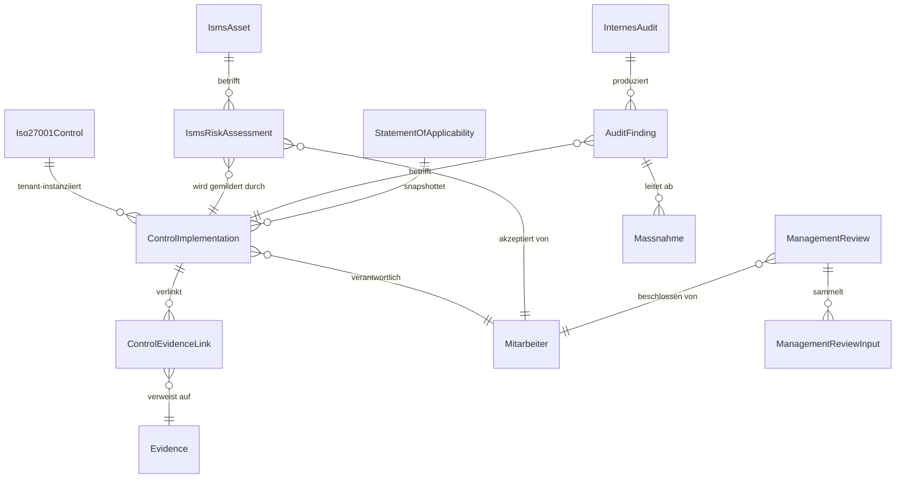

# Phase 3 — ISO-27001-Evidence-Sammler — Design-Spec

> **Status:** Draft 2026-05-17, Phase 3 (nach Phase-1.5/2-Modulen ki_inventar, nis2, datenpannen, avv, hinschg, pflichtunterweisung).
> **Ziel-Persona:** Compliance-Beauftragte:r eines Industrie-Mittelstand-Tenants (50–300 MA), der eine ISO-27001:2022-Zertifizierung anstrebt — entweder freiwillig (Pilot mit Premium-Endkunden) oder kunden-getrieben (Automotive-OEM verlangt TISAX/ISO).
> **Sprint-Aufwand-Schätzung:** ~22–26 h (siehe Plan).

## 1. Hintergrund + Motivation

ISO-27001 wird im Industrie-Mittelstand zunehmend Pflicht-Zertifikat: Automotive-Lieferketten (TISAX baut auf ISO-27001 auf), KRITIS-nahe Branchen, B2B-SaaS-Anbieter. Eine Erst-Zertifizierung kostet typischerweise 30k–80k € (Beratung + Audit) und dauert 9–18 Monate, weil die Evidence-Beschaffung nachträglich passiert.

Vaeren betreibt zu diesem Zeitpunkt bereits sechs Compliance-Module, deren Ergebnisse strukturell genau die Evidence sind, die ein ISO-Auditor sehen will. Das `iso27001`-Modul **erfindet keine neuen Daten**, sondern bündelt die existierenden Quellen unter den 93 Annex-A-Controls und stellt einen Audit-fertigen Mappen-Export bereit.

**Geschäfts-Hypothese:** Der ISO-Sammler ist das Upsell-Argument für „Vaeren Enterprise" (~399 €/Mo statt 99 €/Mo). Ein Pilot-Kunde aus dem Maschinenbau wird vor seinem Erstaudit 20–40 h Beratungs-Aufwand sparen — das rechtfertigt 12 Monate Premium-Subscription.

## 2. Scope-Abgrenzung (Was tun wir NICHT)

- **Kein Zertifizierungs-Ersatz.** Vaeren ersetzt nicht die akkreditierte Zertifizierungsstelle (DEKRA, TÜV, DQS). Wir liefern Evidence — der Auditor entscheidet.
- **Kein vollwertiges ISMS-Tool.** Funktionen wie Schwachstellen-Management, SIEM-Anbindung, automatische Vulnerability-Scans gehören nicht in den Sammler. Ggf. Phase-4-Roadmap.
- **Keine externe Berater-Lizenz.** Wir bauen die Tools für den Endkunden, nicht für externe ISO-Consultants als Multi-Mandanten-Werkzeug.
- **Keine Auto-Zertifikat-Wahrheit durch LLM.** Jede Statusänderung (`not_applicable` → `implemented` → `verified`) ist menschlich verantwortet. LLM liefert nur „Entwurfsvorschläge" zur Implementierungs-Beschreibung.

## 3. User-Stories

1. **Überblick anlegen.** Als CB möchte ich beim Onboarding ins ISO-Modul eine Coverage-Übersicht über alle 93 Annex-A-Controls sehen, geordnet nach Kategorie (A.5 Organisatorisch / A.6 Personell / A.7 Physisch / A.8 Technologisch), damit ich abschätzen kann, was bereits implementiert ist und wo Lücken sind.
2. **Geltungsbereich definieren.** Als CB möchte ich pro Control angeben können, ob es für meinen Tenant anwendbar ist (`applicable` / `not_applicable`), mit Pflicht-Begründung bei „nicht anwendbar" — Auditor verlangt das im Statement of Applicability (SoA).
3. **Implementation dokumentieren.** Als CB möchte ich pro Control eine Implementation-Beschreibung verfassen (3–10 Sätze), Verantwortliche:n zuweisen und ein nächstes Review-Datum setzen.
4. **LLM-Entwurfshilfe.** Als CB möchte ich auf Knopfdruck einen LLM-Entwurf für die Implementation-Beschreibung sehen, der mein bestehendes Compliance-Inventar (KI-Tools, AVV-Liste, NIS2-Antworten, HinSchG-Status) als Kontext nutzt — den Entwurf bearbeite ich, danach speichere ich ihn.
5. **Evidence verlinken.** Als CB möchte ich pro Control bestehende Evidenz-Quellen aus anderen Modulen verlinken (z. B. Control A.5.34 „Privacy and PII" → AVV-Liste + Datenpannen-Register). Vaeren schlägt sinnvolle Verlinkungen automatisch vor; ich bestätige sie einzeln.
6. **Risiken bewerten.** Als CB möchte ich ein Risiko-Register (Asset × Threat × Vulnerability) führen, jedem Eintrag Likelihood/Impact (1–5) zuweisen, einen Treatment-Plan dokumentieren und Restrisiko vom GF akzeptieren lassen.
7. **SoA exportieren.** Als CB möchte ich auf Knopfdruck ein PDF mit allen 93 Controls, Anwendbarkeit + Begründung + Implementation-Status + verlinkter Evidence-Anzahl bekommen.
8. **Management-Review.** Als GF möchte ich jährlich einen Management-Review-Bericht generieren, der die Inputs nach ISO 9.3 (Audit-Ergebnisse, Performance, Risiken, Verbesserungen) zusammenstellt — meine Unterschrift wird als Output gespeichert.
9. **Internes Audit planen.** Als CB möchte ich ein Audit-Programm anlegen (welche Controls werden wann von wem geprüft), Findings dokumentieren, Maßnahmen ableiten und ihre Wirksamkeit nachprüfen.
10. **Compliance-Index-Beitrag.** Als GF möchte ich am Cockpit sehen, dass das ISO-Modul mit seinem Reifegrad in den Master-Compliance-Score einfließt, damit ich Fortschritt über Zeit messen kann.

## 4. Datenmodell

### 4.1 Übersicht



### 4.2 Models (Pseudo-Code, Tenant-Schema)

```python
# backend/iso27001/models.py

class ControlKategorie(TextChoices):
    A5_ORGANISATORISCH = "A5", "A.5 Organisatorische Maßnahmen"
    A6_PERSONELL      = "A6", "A.6 Personelle Maßnahmen"
    A7_PHYSISCH       = "A7", "A.7 Physische Maßnahmen"
    A8_TECHNOLOGISCH  = "A8", "A.8 Technologische Maßnahmen"


class Iso27001Control(models.Model):
    """Katalog-Stammdaten (seed-only, kein User-Input).

    Schemata werden bei `migrate_schemas` aus iso27001/data/annex_a_2022.json geladen.
    Da TENANT_APPS, lebt der Katalog pro Tenant — Tenant kann ihn aber nicht editieren.
    """
    code = CharField(max_length=10, unique=True, db_index=True)  # z.B. "A.5.1", "A.8.23"
    name = CharField(max_length=200)
    description_de = TextField()
    kategorie = CharField(choices=ControlKategorie.choices, max_length=4)
    applicability_default = BooleanField(default=True)
    iso_clause = CharField(max_length=20, blank=True, default="")  # Quer-Referenz auf ISO-Hauptnorm
    sortier_index = PositiveIntegerField()


class ImplementationStatus(TextChoices):
    NICHT_BEWERTET = "nicht_bewertet", "Nicht bewertet"
    NICHT_ANWENDBAR = "nicht_anwendbar", "Nicht anwendbar (SoA-Begründung)"
    GEPLANT = "geplant", "Geplant"
    UMGESETZT = "umgesetzt", "Umgesetzt"
    VERIFIZIERT = "verifiziert", "Umgesetzt + verifiziert"


class ControlImplementation(models.Model):
    """Tenant-Instanz eines Controls: Status + Beschreibung + Verantwortung."""
    control = ForeignKey(Iso27001Control, on_delete=PROTECT, related_name="implementierungen")
    status = CharField(choices=ImplementationStatus.choices, default=NICHT_BEWERTET, max_length=30)
    anwendbar = BooleanField(default=True)
    nicht_anwendbar_begruendung = TextField(blank=True, default="")  # Pflicht wenn !anwendbar
    implementation_beschreibung = TextField(blank=True, default="")
    implementation_vorschlag = TextField(blank=True, default="")  # LLM-Entwurf, separat
    verantwortlich = ForeignKey("core.Mitarbeiter", null=True, blank=True, on_delete=SET_NULL)
    naechstes_review = DateField(null=True, blank=True)
    verifiziert_von = ForeignKey("core.User", null=True, blank=True, on_delete=SET_NULL,
                                 related_name="iso_verifiziert")
    verifiziert_am = DateTimeField(null=True, blank=True)
    created_at, updated_at  # standard

    class Meta:
        unique_together = (("control",),)  # genau eine Impl pro Control pro Tenant


class ControlEvidenceLink(models.Model):
    """N:M-Verbindung Control × bestehende Evidence (über alle Module hinweg).

    Wird teils automatisch erzeugt durch das Mapping in iso27001/mapping.py
    (auto_suggested=True). Bestätigung passiert mit `confirmed_by` setzen
    (RDG: Mensch bestätigt, was vorgeschlagen wurde).
    """
    implementation = ForeignKey(ControlImplementation, on_delete=CASCADE, related_name="evidence_links")
    evidence = ForeignKey("core.Evidence", on_delete=CASCADE, related_name="iso_links")
    quell_modul = CharField(max_length=30)  # "ki_inventar", "nis2", "avv", "datenpannen", "hinschg", "pflichtunterweisung", "manual"
    auto_suggested = BooleanField(default=False)
    confirmed_by = ForeignKey("core.User", null=True, blank=True, on_delete=SET_NULL)
    confirmed_at = DateTimeField(null=True, blank=True)
    notiz = TextField(blank=True, default="")

    class Meta:
        unique_together = (("implementation", "evidence"),)


class IsmsAsset(models.Model):
    """ISO-Asset-Inventar. Eigene Tabelle statt nis2.Asset-Reuse, weil:
      - ISO-Audits verlangen formale Asset-Inventory mit Owner/Klassifizierung.
      - nis2.Asset ist „Self-Check-Light", ISO-Asset hat 7 Pflichtfelder mehr.
      Cross-Link via FK auf nis2.Asset optional (deckungsgleiche Einträge).
    """
    name = CharField(max_length=200)
    asset_typ = CharField(choices=AssetTyp.choices, max_length=30)
    eigentuemer = ForeignKey("core.Mitarbeiter", on_delete=SET_NULL, null=True, blank=True)
    klassifizierung = CharField(choices=Klassifizierung.choices, max_length=20)  # public/intern/vertraulich/streng_vertraulich
    schutzziel_vertraulichkeit = IntegerField(choices=(1,2,3,4,5))
    schutzziel_integritaet = IntegerField(choices=(1,2,3,4,5))
    schutzziel_verfuegbarkeit = IntegerField(choices=(1,2,3,4,5))
    nis2_asset = ForeignKey("nis2.Asset", null=True, blank=True, on_delete=SET_NULL)
    beschreibung, standort, drittanbieter (CharField)


class RiskTreatment(TextChoices):
    REDUZIEREN = "reduzieren", "Reduzieren (Maßnahme)"
    AKZEPTIEREN = "akzeptieren", "Akzeptieren (dokumentiertes Restrisiko)"
    UEBERTRAGEN = "uebertragen", "Übertragen (Versicherung/Vertrag)"
    VERMEIDEN = "vermeiden", "Vermeiden (Aktivität einstellen)"


class IsmsRiskAssessment(models.Model):
    """Risiko-Register-Eintrag. Risk-Score = Likelihood × Impact (1–25)."""
    asset = ForeignKey(IsmsAsset, on_delete=CASCADE, related_name="risiken")
    titel = CharField(max_length=200)
    threat = TextField()         # Bedrohung
    vulnerability = TextField()  # Schwachstelle
    likelihood = IntegerField(choices=(1,2,3,4,5))
    impact = IntegerField(choices=(1,2,3,4,5))
    risk_score_brutto = IntegerField()  # auto: likelihood × impact
    treatment = CharField(choices=RiskTreatment.choices, max_length=20)
    treatment_plan = TextField()
    treatment_vorschlag = TextField(blank=True, default="")  # LLM-Entwurf
    mitigation_controls = ManyToManyField(ControlImplementation, blank=True,
                                          related_name="risiko_mitigierungen")
    restrisiko_likelihood = IntegerField(choices=(1,2,3,4,5), null=True, blank=True)
    restrisiko_impact = IntegerField(choices=(1,2,3,4,5), null=True, blank=True)
    risk_score_netto = IntegerField(null=True, blank=True)
    akzeptiert_von = ForeignKey("core.Mitarbeiter", null=True, blank=True, on_delete=SET_NULL)
    akzeptiert_am = DateTimeField(null=True, blank=True)
    naechstes_review = DateField(null=True, blank=True)


class StatementOfApplicability(models.Model):
    """SoA-Snapshot. Wird beim PDF-Export erzeugt + persistent abgelegt
    (Auditor verlangt Versionierung, weil sich SoA über Zeit ändert)."""
    version = CharField(max_length=20)  # z.B. "1.0", "1.1"
    erstellt_von = ForeignKey("core.User", on_delete=PROTECT)
    erstellt_am = DateTimeField(auto_now_add=True)
    snapshot_data = JSONField()  # vollständiger Stand aller 93 Controls zum Zeitpunkt
    geltungsbereich = TextField()  # Scope-Statement: welche Standorte/Prozesse/Systeme
    pdf_evidence = OneToOneField("core.Evidence", null=True, on_delete=SET_NULL)


class ManagementReviewStatus(TextChoices):
    ENTWURF = "entwurf", "Entwurf"
    DURCHGEFUEHRT = "durchgefuehrt", "Durchgeführt"
    GENEHMIGT = "genehmigt", "Genehmigt"


class ManagementReview(models.Model):
    """Jährlicher Management-Review nach ISO 9.3."""
    review_jahr = PositiveIntegerField()
    durchgefuehrt_am = DateField(null=True, blank=True)
    teilnehmer = TextField()  # Liste Teilnehmer-Namen + Rollen
    status = CharField(choices=ManagementReviewStatus.choices, default=ENTWURF, max_length=20)
    inputs_audit_ergebnisse = TextField(blank=True, default="")
    inputs_findings_status = TextField(blank=True, default="")
    inputs_risiko_aenderungen = TextField(blank=True, default="")
    inputs_isms_performance = TextField(blank=True, default="")
    outputs_verbesserungen = TextField(blank=True, default="")
    outputs_ressourcen_bedarf = TextField(blank=True, default="")
    outputs_zielanpassungen = TextField(blank=True, default="")
    beschlossen_von = ForeignKey("core.Mitarbeiter", null=True, blank=True, on_delete=SET_NULL)
    pdf_evidence = OneToOneField("core.Evidence", null=True, on_delete=SET_NULL)

    class Meta:
        unique_together = (("review_jahr",),)


class InternesAuditStatus(TextChoices):
    GEPLANT = "geplant", "Geplant"
    LAUFEND = "laufend", "Laufend"
    ABGESCHLOSSEN = "abgeschlossen", "Abgeschlossen"


class InternesAudit(models.Model):
    """Audit-Programm-Eintrag (ISO 9.2)."""
    titel = CharField(max_length=200)
    auditzeitraum_von, auditzeitraum_bis = DateField()
    auditor = CharField(max_length=200)  # Name (intern/extern), nicht zwingend Mitarbeiter
    geprueft_controls = ManyToManyField(Iso27001Control, blank=True)
    status = CharField(choices=InternesAuditStatus.choices, default=GEPLANT, max_length=20)
    bericht_evidence = OneToOneField("core.Evidence", null=True, on_delete=SET_NULL)


class FindingSchweregrad(TextChoices):
    KLEIN = "klein", "Nebenbefund (Hinweis)"
    GROSS = "gross", "Hauptbefund (Major)"
    KRITISCH = "kritisch", "Kritisch (Critical)"


class AuditFinding(models.Model):
    audit = ForeignKey(InternesAudit, on_delete=CASCADE, related_name="findings")
    betroffenes_control = ForeignKey(ControlImplementation, null=True, blank=True, on_delete=SET_NULL)
    schweregrad = CharField(choices=FindingSchweregrad.choices, max_length=20)
    beschreibung = TextField()
    massnahme = TextField()
    verantwortlich = ForeignKey("core.Mitarbeiter", null=True, blank=True, on_delete=SET_NULL)
    geplant_bis = DateField()
    erledigt_am = DateTimeField(null=True, blank=True)
    wirksamkeit_geprueft_am = DateTimeField(null=True, blank=True)
    wirksamkeit_bemerkung = TextField(blank=True, default="")


class IsoTaskTyp(TextChoices):
    CONTROL_REVIEW = "control_review", "Control-Review fällig"
    RISIKO_REVIEW = "risiko_review", "Risiko-Review fällig"
    AUDIT_DURCHFUEHRUNG = "audit_durchfuehrung", "Internes Audit durchführen"
    FINDING_MASSNAHME = "finding_massnahme", "Finding-Maßnahme umsetzen"
    MGT_REVIEW_FAELLIG = "mgt_review_faellig", "Management-Review fällig"


class IsoTask(ComplianceTask):
    """Polymorphe ComplianceTask für ISO-Modul."""
    implementation = ForeignKey(ControlImplementation, null=True, blank=True, on_delete=CASCADE)
    risiko = ForeignKey(IsmsRiskAssessment, null=True, blank=True, on_delete=CASCADE)
    audit = ForeignKey(InternesAudit, null=True, blank=True, on_delete=CASCADE)
    finding = ForeignKey(AuditFinding, null=True, blank=True, on_delete=CASCADE)
    mgt_review = ForeignKey(ManagementReview, null=True, blank=True, on_delete=CASCADE)
    task_typ = CharField(choices=IsoTaskTyp.choices, max_length=40)
```

### 4.3 Seed-Katalog `iso27001/data/annex_a_2022.json`

Statische JSON-Datei mit allen 93 Annex-A-Controls aus ISO/IEC 27001:2022. Pro Eintrag: `code`, `name`, `description_de`, `kategorie`, `applicability_default`, `iso_clause`, `sortier_index`. Geladen via Management-Command `seed_iso27001_controls` und in `migrate_schemas` als Daten-Migration für jeden Tenant.

### 4.4 Auto-Mapping-Regeln (`iso27001/mapping.py`)

Statische Hash-Tabelle `MODULE_TO_CONTROLS: dict[str, list[str]]` plus pro Quell-Modul eine Funktion `suggest_evidence_links(implementation: ControlImplementation) -> list[Evidence]`. Beispiel-Mapping:

| Annex-A-Control | Quell-Modul(e) | Auto-Evidence |
|---|---|---|
| A.5.34 Privacy and PII | avv, datenpannen | AVV-Liste, Datenpannen-Register-Export |
| A.6.3 Awareness | pflichtunterweisung | Schulungs-Zertifikate |
| A.8.2 Privileged access rights | core (User-Liste) | User-Rollen-Export |
| A.5.7 Threat intelligence | nis2 | NIS2-Reife-Antwort „monitoring" |
| A.5.30 ICT readiness for BCM | nis2 | NIS2-Reife-Antwort „krise" |
| A.5.23 Cloud services | ki_inventar | KI-Tool-Liste mit AVV-Links |
| A.6.8 Information security event reporting | hinschg | HinSchG-Bearbeiter-Dashboard-Export |
| A.5.7 Threat intelligence | datenpannen | Datenpannen-Trend-Bericht |
| (… alle 93 mit Default-Leer für nicht-abgedeckte …) | | |

Bei `ControlImplementation.save()` (post_save-Signal) wird `suggest_evidence_links()` ausgeführt und neue `ControlEvidenceLink(auto_suggested=True, confirmed_by=null)` angelegt — Mensch bestätigt einzeln.

## 5. API-Endpoints

### Interne Endpoints (auth required, Permission `iso27001.bearbeiten` / `lesen`)

| Method | Path | Permission | Zweck |
|---|---|---|---|
| GET | `/api/iso27001/controls/` | lesen | Liste aller 93 Controls + Implementation-Status (Filter: kategorie, status, verantwortlich) |
| GET | `/api/iso27001/controls/{code}/` | lesen | Detail eines Controls + verlinkte Evidence + Risiko-Mitigierungen |
| PATCH | `/api/iso27001/implementations/{id}/` | bearbeiten | Status/Beschreibung/Verantwortlich/Review-Datum |
| POST | `/api/iso27001/implementations/{id}/llm-entwurf/` | bearbeiten | LLM-Vorschlag für Implementation-Beschreibung (RDG-Layer-2-validiert) |
| POST | `/api/iso27001/implementations/{id}/verify/` | bearbeiten | Setzt status=VERIFIZIERT + verifiziert_am/_von (HITL-Gate) |
| GET | `/api/iso27001/implementations/{id}/evidence-suggestions/` | bearbeiten | Liefert nicht-bestätigte Auto-Mapping-Vorschläge |
| POST | `/api/iso27001/evidence-links/{id}/confirm/` | bearbeiten | Bestätigt einen Auto-Mapping-Vorschlag |
| DELETE | `/api/iso27001/evidence-links/{id}/` | bearbeiten | Verlinkung entfernen |
| GET/POST/PATCH | `/api/iso27001/risiken/` | bearbeiten | Risiko-Register CRUD |
| POST | `/api/iso27001/risiken/{id}/treatment-vorschlag/` | bearbeiten | LLM-Entwurf für Treatment-Plan |
| POST | `/api/iso27001/risiken/{id}/akzeptieren/` | bearbeiten | Restrisiko-Akzeptanz durch GF |
| GET/POST | `/api/iso27001/assets/` | bearbeiten | ISMS-Asset-Inventar CRUD |
| POST | `/api/iso27001/soa/` | bearbeiten | SoA-Version erzeugen + PDF rendern |
| GET | `/api/iso27001/soa/{version}/pdf/` | lesen | PDF-Download des SoA-Snapshots |
| GET/POST/PATCH | `/api/iso27001/management-reviews/` | bearbeiten (GF only für POST/PATCH) | Management-Review CRUD |
| POST | `/api/iso27001/management-reviews/{id}/inputs-vorbefuellen/` | bearbeiten | Sammelt automatisch Inputs aus letzten 12 Monaten |
| GET | `/api/iso27001/management-reviews/{id}/pdf/` | lesen | PDF-Export |
| GET/POST/PATCH | `/api/iso27001/audits/` | bearbeiten | Internes Audit CRUD |
| GET/POST/PATCH | `/api/iso27001/findings/` | bearbeiten | Findings + Maßnahmen CRUD |
| GET | `/api/iso27001/dashboard/` | lesen | Coverage-Statistik: implemented/93, verifiziert/93, Auditor-Readiness-Score |

## 6. Frontend

### 6.1 Routes

| Route | Komponente | Zweck |
|---|---|---|
| `/iso27001` | `Iso27001Dashboard` | Coverage-Donut (verifiziert / umgesetzt / geplant / offen / N/A), Auditor-Readiness-Score (0–100), Top-5-Risiken, Nächste Reviews |
| `/iso27001/controls` | `ControlList` | 93er-Tabelle mit Filter (Kategorie, Status, Verantwortlich), Inline-Status-Edit |
| `/iso27001/controls/:code` | `ControlDetail` | Implementation-Editor mit LLM-Entwurfshilfe, Evidence-Verlinkung (bestätigt + vorgeschlagen), History (AuditLog-Ausschnitt), Risiko-Mitigierungen |
| `/iso27001/risiken` | `RiskRegister` | Tabelle nach Risk-Score sortiert, Heatmap (5×5 Matrix), Filter |
| `/iso27001/risiken/:id` | `RiskDetail` | Treatment-Plan-Editor mit LLM-Vorschlag, Mitigation-Controls-Verlinkung |
| `/iso27001/assets` | `AssetList` | Asset-Inventar mit Klassifizierung + Schutzzielen |
| `/iso27001/soa` | `SoAGenerator` | SoA-Versionen-Liste + „Neue Version erzeugen"-Wizard |
| `/iso27001/audits` | `AuditProgram` | Audit-Plan-Liste + Findings je Audit |
| `/iso27001/audits/:id` | `AuditDetail` | Findings + Maßnahmen-Tracking |
| `/iso27001/management-review` | `MgtReviewList` | Jahres-Reviews |
| `/iso27001/management-review/:id` | `MgtReviewDetail` | Inputs/Outputs-Editor + PDF-Export |

### 6.2 UI-Skizzen (verbal)

- **Coverage-Donut** im Dashboard mit 5 Segmenten in den Status-Farben (verifiziert grün, umgesetzt blau, geplant gelb, nicht-bewertet grau, nicht-anwendbar weiß). Mittelpunkt: „X / 93".
- **Control-Detail** zeigt drei Spalten: links Metadaten (Code, Name, ISO-Klausel, Beschreibung des Controls), Mitte Implementation-Editor (Textarea + Speichern, daneben „LLM-Entwurf erzeugen"-Button), rechts Evidence-Verknüpfungen (bestätigte Liste + Section „Vorschläge" mit „Bestätigen"-Button pro Eintrag).
- **Risk-Heatmap** als interaktives 5×5-Grid; Klick auf eine Zelle filtert die Liste auf Risiken in diesem Likelihood/Impact-Quadranten.
- **LLM-Vorschlags-Panel** zeigt den Entwurf in einer eigenen Card mit gelbem Border + Disclaimer-Banner („Entwurf — bitte vor Übernahme prüfen. KEIN juristischer Rat.").
- **Auditor-Readiness-Score** Tooltip enthüllt die Formel (siehe 8.2).

## 7. RDG-Schutz (Layer 1–3)

ISO-27001-Controls werden vom LLM auf zwei Punkten unterstützt:

1. **Implementation-Beschreibung-Entwurf:** Das LLM erhält den Control-Text + den Tenant-Kontext (Branche, Mitarbeiterzahl, bereits verlinkte Module-Daten) und schlägt 5–10 Sätze Implementation-Beschreibung vor.
2. **Treatment-Plan-Entwurf:** Das LLM bekommt Threat/Vulnerability/Likelihood/Impact und schlägt einen Treatment-Plan vor.

**Layer 1 — System-Prompt-Erzwingung:**
- Antwort MUSS beginnen mit „Entwurf:".
- Konjunktiv-Sprache erzwingen („könnte umgesetzt werden", „bietet sich an").
- Verboten: „erfüllt", „gilt als konform", „stuft sich ein", „wir kategorisieren".
- Erinnerung am Ende: „Dies ist KEIN juristischer Rat und kein Audit-Ergebnis."

**Layer 2 — Output-Validator (`core/llm_validator.py`):**
- Bestehender Validator wird mit zusätzlicher `ISO_FORBIDDEN_PHRASES`-Liste erweitert:
  - „erfüllt die Norm" / „ist konform" / „entspricht ISO 27001"
  - „wir bewerten als" / „abschließende Einstufung"
  - „risikofrei" / „vollständig abgesichert"
- Bei Treffer: Re-Prompt mit verschärftem Prompt, bei zweitem Treffer `LLMValidationError` + Fallback auf statisches Template.

**Layer 3 — Human-in-the-Loop:**
- LLM-Output landet immer in `implementation_vorschlag` (separates Feld), NIE direkt in `implementation_beschreibung`.
- UI rendert Vorschlag in eigenem Panel mit „Übernehmen"-Button — Klick kopiert in das Haupt-Feld, dann muss der CB explizit „Speichern" drücken.
- `status=VERIFIZIERT` erfordert separaten Verify-Endpoint mit Username-Stamp (`verifiziert_von`, `verifiziert_am`); kein Auto-Verify durch LLM, AuditLog-Pflicht.
- SoA-Export, Management-Review-PDF, Audit-Bericht: jeweils mit großem Header „Vom Tenant verantwortet; Vaeren liefert nur das Erfassungs-Werkzeug."

## 8. Compliance-Score-Integration

### 8.1 Erweiterung `core/scoring.py`

Eine neue Funktion `_module_score_iso27001()` analog `_module_score_pflichtunterweisung()`:

```python
def _module_score_iso27001() -> ModuleScore:
    """Score = (verifizierte + 0.7 × umgesetzte + 0.3 × geplante) / anwendbare Controls × 100.

    Wenn keine ControlImplementation existiert oder alle nicht_bewertet → Score 0.
    """
```

### 8.2 Auditor-Readiness-Score (intern im Modul)

Separate Metrik nur im ISO-Dashboard sichtbar, NICHT im Master-Compliance-Index (dort fließt nur der vereinfachte Module-Score ein):

```
Readiness = 0.40 × Controls-Coverage          # verifiziert vs. anwendbar
          + 0.20 × Risiken-Behandelt          # Risiken mit Treatment != akzeptieren OR akzeptiert_von gesetzt
          + 0.15 × Audit-Programm-Aktualität  # letztes internes Audit < 12 Monate
          + 0.15 × Management-Review-Aktualität # letzter MR < 13 Monate
          + 0.10 × Evidence-Coverage          # Anteil Controls mit ≥1 bestätigter Evidence
```

### 8.3 Gewicht im Master-Score

Der Master-Score in `calculate_compliance_score()` ändert sich von

```
Master = 0,50 × Pflichten + 0,20 × Fristen + 0,30 × Module-Avg
```

zu (unchanged, Module-Liste wächst aber um `iso27001`). Wenn ein Tenant das Modul ungenutzt lässt (alle Controls `nicht_bewertet`), liefert `_module_score_iso27001()` den Score `100` (Neutralität, sonst wird das ganze Cockpit rot beim Erstkontakt). Sobald mindestens eine Implementation `status != nicht_bewertet` ist, zählt der Modul-Score regulär.

## 9. Signals + Auto-Tasks

In `iso27001/signals.py`:

- `post_save` auf `ControlImplementation`: bei Statuswechsel auf `UMGESETZT` → IsoTask `CONTROL_REVIEW` mit Frist `naechstes_review` (Default +12 Monate) anlegen, wenn nicht vorhanden.
- `post_save` auf `IsmsRiskAssessment`: bei Anlage IsoTask `RISIKO_REVIEW` mit Frist `+12 Monate` anlegen.
- `post_save` auf `AuditFinding`: bei Schweregrad ≥ `GROSS` IsoTask `FINDING_MASSNAHME` mit Frist `geplant_bis`.
- `post_save` auf `InternesAudit` (status=GEPLANT): IsoTask `AUDIT_DURCHFUEHRUNG` mit Frist `auditzeitraum_von - 14 Tage`.
- Annual Celery-Beat (Phase 4): erzeugt IsoTask `MGT_REVIEW_FAELLIG` jeweils 14 Tage vor Jahresfrist. In Phase 3 manuell oder per Management-Command.
- `post_save` auf `ControlImplementation` (created=True): Auto-Mapping-Suggestion-Lauf für dieses Control via `mapping.suggest_evidence_links()` — anonyme `ControlEvidenceLink(auto_suggested=True)`-Einträge entstehen.

## 10. Tests + Qualitäts-Gates

### 10.1 Pytest-Test-Pakete

- `iso27001/tests/test_models.py` — Model-Smoke, unique-Constraints, risk_score-Auto-Berechnung.
- `iso27001/tests/test_seed.py` — `seed_iso27001_controls`-Command produziert genau 93 Einträge; Re-Run ist idempotent.
- `iso27001/tests/test_api_controls.py` — DRF-Tests für `controls/` + `implementations/` (List/Detail/Patch/Verify/LLM-Entwurf).
- `iso27001/tests/test_api_risiken.py` — Risk-Register-CRUD + Treatment-Vorschlag + Akzeptanz-Pfad.
- `iso27001/tests/test_api_soa.py` — SoA-Erzeugung + PDF-Render (WeasyPrint-Mock).
- `iso27001/tests/test_api_audit.py` — Audit + Findings + Maßnahmen-Lifecycle.
- `iso27001/tests/test_signals.py` — Auto-Task-Erzeugung bei Statuswechseln, Auto-Mapping-Vorschläge.
- `iso27001/tests/test_mapping.py` — Mapping-Tabelle: für jede der 6 Quell-Module mindestens 1 erwarteter Control-Eintrag.
- `iso27001/tests/test_rdg_validator.py` — LLM-Output mit verbotenen Phrasen wird gefiltert, Fallback-Template wird verwendet.
- `iso27001/tests/test_scoring.py` — Score-Funktion in 4 Edge-Cases (leer, alle nicht-bewertet, alle verifiziert, gemischt).
- `iso27001/tests/test_isolation.py` — Multi-Tenant-Isolation: Tenant-A-Risiko ist in Tenant-B nicht queryable (kritischer CI-Gate).
- `iso27001/tests/test_permissions.py` — Permission-Matrix für die 5 Rollen (GF / CB / QM / HR / Mitarbeiter).

### 10.2 Frontend-Tests

- 3 Storybook-Stories: `ControlList`, `ControlDetail`, `RiskHeatmap` mit Interaction-Test (Click → Filter).
- Playwright-E2E auf `main`-Branch: 1 Journey „CB öffnet ISO-Dashboard, editiert Control A.5.1, ruft LLM-Entwurf ab, übernimmt + speichert" (kein echter LLM-Call, gemockt).

### 10.3 CI-Gates

- `pytest --cov=iso27001 --cov-fail-under=80` (lokales Modul-Gate).
- Globaler `--cov-fail-under=80` bleibt unverändert.
- OpenAPI-Schema-Sync MUSS für neue Endpoints aktualisiert werden.
- Multi-Tenant-Isolation-Test ist Pflicht-Gate.

## 11. Datenschutz + Speicherung

- ISO-Daten sind **nicht** verschlüsselt-at-rest (anders als HinSchG). Begründung: Auditor-Lesbarkeit, GF-Lese-Pflicht.
- `IsmsAsset` darf keine personenbezogenen Daten beinhalten — UI weist darauf hin (Hinweis-Banner).
- AuditLog-Pflicht für jede Statusänderung an `ControlImplementation`, `IsmsRiskAssessment`, `ManagementReview`, `AuditFinding`. AuditLog-Auto-Population läuft über das bereits existierende `core.models.AuditLog`-Pattern.
- PDF-Exporte (SoA, Mgt-Review, Audit-Bericht) landen als `core.Evidence(immutable=True)` im lokalen Volume `vaeren-media/iso27001/{tenant_id}/`.

## 12. Migrations-Strategie

- Erste Migration: nur Stammdaten-Modelle (`Iso27001Control` + Seed).
- Zweite Migration: Implementation + Evidence-Links + Asset.
- Dritte Migration: Risk-Register.
- Vierte Migration: SoA + Management-Review + Audit + Finding + IsoTask.
- Seed-Migration (`0002_seed_annex_a.py`) lädt die JSON-Datei und ist **idempotent** (`update_or_create` pro `code`). Re-Anwenden bei späteren Norm-Updates (ISO-2025-Revision) sicher.
- Migration-Pfad ist **rückwärtskompatibel**: bestehende Module bleiben unverändert. Optional kann `core.Evidence` ein neues nullbares `iso_relevant`-Bool-Feld bekommen — nicht notwendig in Phase 3, da Verlinkung über `ControlEvidenceLink` läuft.

## 13. Akzeptanzkriterien

1. Tenant kann durch Onboarding-Klick die 93 Annex-A-Controls in seinem Schema sehen.
2. CB kann pro Control den Status setzen und Verantwortliche zuweisen; AuditLog dokumentiert die Änderung.
3. LLM-Entwurfshilfe liefert Vorschläge mit Pflicht-Disclaimer; Validator filtert verbotene Phrasen.
4. Mindestens 30 von 93 Controls bekommen automatische Evidence-Vorschläge aus den 6 Bestandsmodulen (Mapping-Coverage).
5. Risiko-Register erlaubt CRUD inkl. Heatmap-Visualisierung; Risk-Score wird automatisch berechnet.
6. SoA-Export erzeugt ein PDF mit allen 93 Controls + Versions-Snapshot.
7. Management-Review-PDF lässt sich generieren, Inputs werden automatisch aus letzten 12 Monaten Daten vorbefüllt.
8. Internes Audit kann angelegt werden, Findings werden getrackt, Maßnahmen führen zu IsoTask-Auto-Erzeugung.
9. ISO-Modul-Score fließt mit korrektem Gewicht in den Master-Compliance-Score ein; Tenants ohne aktive ISO-Nutzung sehen keinen Score-Einbruch.
10. CI 3-Job grün inkl. `pytest --cov-fail-under=80`, OpenAPI-Sync und Multi-Tenant-Isolation-Test.
11. Playwright-E2E „LLM-Entwurf-Journey" auf main grün.
12. Demo-Tenant `demo` hat 10 ControlImplementations + 3 Risiken + 1 SoA-Snapshot als Fixture nach `migrate_schemas`.

## 14. Out-of-Scope (Phase 4 oder später)

- Automatischer Vulnerability-Scanner-Anschluss (OpenVAS / Nessus).
- TISAX-Mapping (eigener Audit-Standard auf ISO-Basis, andere Score-Logik).
- Externe Auditor-Lesezugriffe (eigene Rolle „Auditor" mit Read-Only-Token, Pflicht ab erstem realen Erstaudit).
- Multi-Standort-Scoping (SoA-Scope pro Werk).
- Auto-Erinnerung via E-Mail bei `naechstes_review` (kommt mit Celery-Beat-Setup in Phase 4).
- KPI-Export ins Sponty-/Datenpannen-Trend-Dashboard.
- Word-Export-Alternative zum PDF (Auditoren bevorzugen PDF, manche wollen Word).
- Auto-Synchronisation des `IsmsAsset`-Inventars mit IT-Asset-Management-Systemen (Lansweeper, etc.).

## 15. Risiken + Mitigationen

| Risiko | Mitigation |
|---|---|
| Auditor lehnt unsere SoA-Form ab | SoA-Template orientiert sich exakt am Anhang-A-Format der ISO 27001:2022. Beim Pilot-Kunden vor Erstaudit ein Probe-Audit-Review durch externen Berater einkaufen. |
| LLM-Vorschlag landet versehentlich produktiv | Drei Layer (System-Prompt, Validator, HITL). `implementation_vorschlag` wird in eigener Feld-Spalte gespeichert + UI-Trennung. Tests in `test_rdg_validator.py`. |
| 93 Controls überfordern KMU-Kunden | Onboarding-Wizard mit Schnell-Modus „Welche 30 Controls sind am häufigsten Pflicht?" — nicht in Phase 3 (YAGNI), aber als Marketing-Argument vorbereitet. |
| Performance bei Auto-Mapping (Bulk-Eintrag-Anlage) | Auto-Mapping läuft als async Celery-Task (`mapping_suggest_async`); sync-Path fallback. Phase 3 in-process, sofern <2 s bei 93 Controls (Benchmark in Test). |
| ISO-Norm-Update (ISO 27002:2025+) bricht Katalog | Seed-Daten in JSON, Update durch Re-Run des Seeders. Versionierung der Stammdaten via `Iso27001Control.norm_version` (Phase 4). |
| Cross-Tenant-Datenleck im Risiko-Register | Multi-Tenant-Isolation-Test ist CI-Pflicht. Encryption nicht nötig, da Auditor-Lese-Bedarf, aber Tenant-Schema-Isolation reicht. |
| Konrad-Kapazität: Phase-3-Aufwand >25 h | Plan-Schnitt in 14 Schritte, jeder einzeln abschließbar (Feature-Completion-Discipline). Hard-Cap bei 28 h, danach Sub-Scope (z. B. Management-Review nach Phase 3b). |
