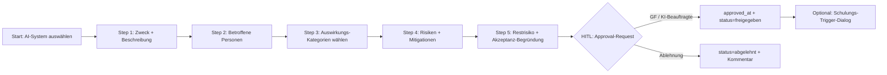
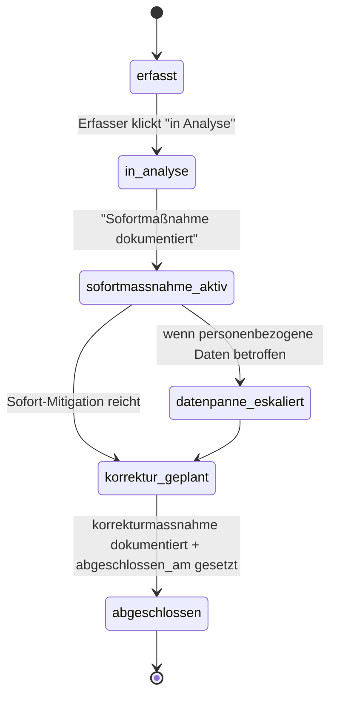

# ISO/IEC 42001:2023 — KI-Management-System für Vaeren (Phase-3-Modul)

> **Datum:** 2026-05-17
> **Autor:** Konrad + Claude (Architekt-Modus)
> **Scope:** Phase-3-Modul „ISO-42001 AIMS" — baut auf KI-Inventar (Phase-1.5) auf, integriert mit Pflichtunterweisung, Datenpannen und AVV.
> **Out-of-Scope:** ISO-27001-Audit-Pfad (separate Spec, Phase-3-Tranche-2), Zertifizierungs-Begleitung durch externen Auditor (Beratung, kein Code).

---

## 1. Motivation & Geschäfts-Kontext

ISO/IEC 42001:2023 ist die **erste internationale Management-Norm für Künstliche Intelligenz**. Sie fordert von einer Organisation, die KI-Systeme entwickelt oder einsetzt, ein dokumentiertes **AI Management System (AIMS)** — analog zu ISO 9001 (Qualität), ISO 14001 (Umwelt) und ISO 27001 (Information-Security).

**Warum für Vaeren-Kunden relevant?**

1. **EU-AI-Act-Konvergenz:** Der AI Act fordert in Art. 17 für Hochrisiko-KI „ein Qualitätsmanagement-System" — ISO 42001 erfüllt diese Anforderung als anerkannter Standard.
2. **B2B-Großkunden-Erwartung:** Bosch, Siemens, ZF u. a. fragen ihre Lieferanten bereits 2026 nach ISO-42001-Konformität (analog ISO 27001 für IT-Dienstleister). Vaeren-Zielgruppe Industrie-Mittelstand sitzt genau in dieser Kette.
3. **Differenzierung gegenüber MVP-KI-Inventar:** Das KI-Inventar (Phase 1.5) listet KI-Tools auf — ISO 42001 verlangt darüber hinaus dokumentierte Prozesse (Lifecycle, Impact-Assessments, Policies, Incident-Management, Management-Review). Das ist die Pflicht-Erweiterung für Kunden, die nicht nur „compliant aussehen", sondern auditierbar sein wollen.
4. **Modul-Preisgestaltung:** ISO-42001-Modul wird Add-on für „Vaeren Professional"-Tier — Hebel für Upsell ab Plan-2-Tarif.

**Was die Norm konkret verlangt** (sehr verkürzt, juristische Tiefe im Annex):

- Kapitel 4–10 (Management-System-Pflicht, analog Annex SL): Kontext, Führung, Planung, Ressourcen, Betrieb, Evaluierung, Verbesserung.
- **Annex A:** 38 Controls in 9 Kategorien (A.2–A.10). Jedes Control muss entweder umgesetzt **oder begründet ausgeschlossen** werden (Statement of Applicability, SoA).
- **Annex B:** Implementierungs-Guidance (nicht-prüfpflichtig, aber Best-Practice-Quelle für LLM-Vorschläge).

---

## 2. Architektur-Entscheidungen

### 2.1 Nicht-verhandelbare Constraints (aus CLAUDE.md übernommen)

| Constraint | Auswirkung |
|---|---|
| Multi-Tenant-Isolation via `django-tenants` | App `iso42001/` ist Tenant-Schema-App. Public-Schema enthält nur den schreibgeschützten Norm-Katalog (`Iso42001Control` Stammdaten). |
| RDG-3-Layer | Jeder LLM-Output (AIIA-Vorschläge, Policy-Entwürfe, Incident-Klassifizierung) ist Vorschlag, nicht Entscheidung. Output-Validator + HITL-Gate-Pflicht. |
| AuditLog-Immutability | Jeder Statuswechsel von `AiImpactAssessment.status`, `AiPolicy.ratified`, `AiIncident.severity` etc. erzeugt AuditLog-Eintrag. |
| Tests ≥ 80 % Coverage, CI-Gate | pytest-django, 4-Schichten-Test-Strategie, Multi-Tenant-Isolation-Test als kritischer Gate. |
| Niemals echte LLM-Calls in Tests | Mocking via `responses`-Lib + `mock`. |
| Feature-Completion-Discipline | Modul wird in 1 Sprint komplett gebaut (Backend + Frontend + Tests + Deploy-fähig), keine Halb-Stubs. Wenn zu groß → in Plan-Sub-Slices schneiden, jedes für sich abgeschlossen. |

### 2.2 Modul-Architektur-Entscheidungen

| Entscheidung | Wahl | Begründung |
|---|---|---|
| **Eigene Django-App** | `iso42001/` als Tenant-Schema-App | Domain-Boundary-Regel. Cross-Module-Zugriffe nur über Services (`ki_inventar.services`, `pflichtunterweisung.services`). |
| **AI-System ↔ KI-Tool** | `AiSystemRegistration` mit 1:1-FK auf `ki_inventar.KITool`, **erweitert** statt dupliziert | Hard-Constraint aus Aufgabenstellung. KiTool bleibt Single-Source-of-Truth für Stammdaten (Name, Anbieter, Risiko-AI-Act, Status). AiSystemRegistration ergänzt AIMS-spezifische Felder. Lookup-Pattern: `KITool.aims_registrierung` (`OneToOneField(related_name=…)`). |
| **Norm-Katalog `Iso42001Control`** | Public-Schema (kein Tenant-Schema), seed via Data-Migration | Norm ist global, ändert sich nur bei ISO-Revision (alle 5–10 Jahre). Identisch für alle Tenants. Spart Schema-Daten-Duplikation. Pattern analog NIS2-Fragen-Konstante, aber DB-Modell weil 38 Records mit Beschreibungstext zu lang für Code-Liste sind. |
| **Pro-Tenant-Status** | `ControlImplementation` (Tenant-Schema) referenziert `Iso42001Control.code` per CharField (lose Kopplung über Public-Schema-Grenze hinweg — kein FK, weil cross-schema) | django-tenants verbietet FKs über Schema-Grenzen. Tenant-Tabelle hält nur den Control-Code („A.2.2") + lokalen Status. UI joinen wir application-side. |
| **AIIA-Workflow-Modell** | Eigene State-Machine in `AiImpactAssessment.status` (`entwurf` → `bewertung` → `approval_offen` → `freigegeben` / `abgelehnt` → `archiviert`) via Status-Transitions in Service-Layer, nicht via `django-fsm` (Lib abandoned) | YAGNI + Pattern-Konsistenz: HinSchG-Meldung macht es genauso (eigene `MeldungStatus` + Service-Methode). |
| **Policy-Versionierung** | `AiPolicy` mit `version` (int) + `parent` (FK self). Neue Version = neue Row, alte bleibt mit `aktiv=False` | Audit-Pflicht: alte Policies dürfen nicht überschrieben werden. Lese-Lookup über `AiPolicy.objects.filter(geltungsbereich=…, aktiv=True).first()`. |
| **Kenntnisnahme-Tracking** | `AiPolicyKenntnisnahme(policy_version FK, mitarbeiter FK, bestaetigt_am)` analog `SchulungsTask` aber leichtgewichtig | Mitarbeiter klickt „Gelesen", erzeugt Row. Auswertung: „X von Y MA haben Policy v3 bestätigt". |
| **Incident-Modell** | `AiIncident` als eigenständiges Modell, NICHT als Subklasse von `core.ComplianceTask` | Incident ist *passiv* (Vorfall, der dokumentiert wird), Task ist *aktiv* (Pflicht, die erledigt werden muss). Aus Incident werden Tasks abgeleitet (z. B. „Korrekturmaßnahme planen", „BNetzA-Meldung erstellen"). |
| **Datenpannen-Brücke** | `AiIncident` hat optionales FK `datenpanne` → `datenpannen.Datenpanne` | Wenn KI-Vorfall personenbezogene Daten betrifft → Datenpannen-Pflicht (Art. 33 DSGVO, 72h). Service-Methode `AiIncident.eskaliere_als_datenpanne()` legt automatisch Datenpanne mit vorausgefüllten Feldern an. |
| **AVV-Brücke** | `AiSystemRegistration.drittpartei_avv` → `avv.AVV` (FK optional) | Wenn KI-Tool von Drittanbieter (`KITool.anbieter`) und personenbezogene Daten verarbeitet → AVV-Pflicht. UI-Hinweis-Karte „AVV fehlt für Tool X". |
| **Pflichtunterweisungs-Brücke** | Service `auto_trigger_ki_schulung(ai_system, ma_liste)` legt SchulungsWelle eines KI-Kompetenz-Kurses an, wenn `AiSystemRegistration.risiko_aims=hoch` | Service-Aufruf bei Statuswechsel „freigegeben", HITL-Bestätigung („Schulung anstoßen?" Dialog) — nicht automatisch, weil GF-Entscheidung. |
| **LLM-Integration** | Über bestehende `llm.py`-Patterns (analog `ki_inventar/llm.py`) — Fast-Modell für Klassifizierung, Reasoning-Modell für AIIA-Entwürfe + Policy-Entwürfe | Spec §3 LLM-Stack. RDG-Layer-2-Validator (Output-Vokabular-Check) Pflicht. |
| **Frontend-Routing** | `/iso42001` (Dashboard), `/iso42001/controls`, `/iso42001/policies`, `/iso42001/ki-systeme`, `/iso42001/aiia/:id` (Wizard), `/iso42001/incidents` | Konsistent mit `/ki-inventar`, `/nis2`, `/avv`. |
| **Compliance-Index-Gewichtung** | Modul-Gewicht **15 Punkte** (von 100) — höher als NIS2 (10), niedriger als Pflichtunterweisung (25), weil B2B-Hebel groß aber nur für KI-aktive Kunden relevant | Score-Berechnung im Detail in §7. |
| **Statement-of-Applicability** | `ControlImplementation.anwendbar` Boolean + `nicht_anwendbar_begruendung` Text | ISO-42001-Kern: jedes Control muss aktiv begründet werden, auch wenn ausgeschlossen. SoA-Export-PDF (WeasyPrint) ist Audit-Artefakt. |
| **Management-Review** | `AimsManagementReview` (jährlich) — Pflicht-Erinnerung via ComplianceTask, Inhalt: Inputs (Incidents, AIIAs, Kennzahlen) + Outputs (Entscheidungen, Maßnahmen) | ISO-42001 Kapitel 9.3 Pflicht. Auto-Anlage einer Task „Management-Review fällig" 11 Monate nach letzter freigegebener Review. |
| **Out-of-Scope MVP-Phase-3-Sprint-1** | (1) Automatischer SoA-PDF-Export — kommt Sub-Sprint 2, (2) BNetzA-Meldeformular-PDF (KI-Vorfall meldepflichtig nach AI-Act Art. 73) — Sub-Sprint 2, (3) Bias-Test-Workflow-Engine (nur Felder erfassen, kein Automatisierungs-Run) — Phase 4 | YAGNI bis Pilot-Kunde fordert |

---

## 3. Datenmodell

### 3.1 Public-Schema (`tenants/models.py` Erweiterung — read-only Norm-Katalog)

```python
class Iso42001ControlKategorie(TextChoices):
    A2_POLICIES = "a2_policies", "A.2 Policies"
    A3_ORGANIZATION = "a3_organization", "A.3 Internal Organization"
    A4_RESOURCES = "a4_resources", "A.4 Resources for AI Systems"
    A5_IMPACT = "a5_impact", "A.5 Assessing Impacts"
    A6_LIFECYCLE = "a6_lifecycle", "A.6 AI System Life Cycle"
    A7_DATA = "a7_data", "A.7 Data for AI Systems"
    A8_INFORMATION = "a8_information", "A.8 Information for Interested Parties"
    A9_USE = "a9_use", "A.9 Use of AI Systems"
    A10_THIRD_PARTY = "a10_third_party", "A.10 Third-Party Relationships"


class Iso42001Control(models.Model):
    """Stammdaten aller 38 Annex-A-Controls. Public-Schema, schreibgeschützt für Tenants."""
    code = models.CharField(max_length=10, unique=True)            # "A.2.2"
    title_de = models.CharField(max_length=200)
    description_de = models.TextField()
    kategorie = models.CharField(max_length=30, choices=Iso42001ControlKategorie.choices)
    annex_b_guidance_url = models.URLField(blank=True, default="")
    applicability_default = models.BooleanField(
        default=True,
        help_text="Voreinstellung im SoA. False = typischerweise nur für KI-Entwickler relevant.",
    )
    reihenfolge = models.PositiveSmallIntegerField(default=0)
```

### 3.2 Tenant-Schema (`iso42001/models.py`)

```python
# --- Statement of Applicability ---
class ControlImplementationStatus(TextChoices):
    OFFEN = "offen", "Offen"
    GEPLANT = "geplant", "Geplant"
    UMGESETZT = "umgesetzt", "Umgesetzt"
    ABGESCHLOSSEN = "abgeschlossen", "Abgeschlossen + dokumentiert"
    NICHT_ANWENDBAR = "nicht_anwendbar", "Nicht anwendbar (SoA-Ausschluss)"


class ControlImplementation(models.Model):
    control_code = models.CharField(max_length=10, db_index=True)  # lose Kopplung Public→Tenant
    anwendbar = models.BooleanField(default=True)
    nicht_anwendbar_begruendung = models.TextField(blank=True, default="")
    status = models.CharField(
        max_length=30,
        choices=ControlImplementationStatus.choices,
        default=ControlImplementationStatus.OFFEN,
    )
    beschreibung = models.TextField(blank=True, default="")
    verantwortlicher = models.ForeignKey(
        Mitarbeiter, on_delete=models.SET_NULL, null=True, blank=True,
        related_name="iso42001_controls",
    )
    review_datum = models.DateField(null=True, blank=True)
    last_reviewed_at = models.DateTimeField(null=True, blank=True)
    created_at = models.DateTimeField(auto_now_add=True)
    updated_at = models.DateTimeField(auto_now=True)

    class Meta:
        unique_together = [("control_code",)]


# --- KI-Policy (Versionsverwaltung) ---
class AiPolicyGeltungsbereich(TextChoices):
    ALLGEMEIN = "allgemein", "Allgemeine KI-Policy"
    AKZEPTABLE_NUTZUNG = "akzeptable_nutzung", "Akzeptable Nutzung (Mitarbeiter)"
    INCIDENT = "incident", "Vorfall-Management-Policy"
    LIFECYCLE = "lifecycle", "KI-Lifecycle-Policy"
    DRITTPARTEI = "drittpartei", "Drittpartei-KI-Policy"


class AiPolicy(models.Model):
    geltungsbereich = models.CharField(max_length=40, choices=AiPolicyGeltungsbereich.choices)
    titel = models.CharField(max_length=200)
    inhalt_markdown = models.TextField()
    version = models.PositiveIntegerField(default=1)
    parent = models.ForeignKey("self", null=True, blank=True, on_delete=models.SET_NULL,
                               related_name="nachfolger")
    ratified_at = models.DateField(null=True, blank=True)
    ratified_by = models.ForeignKey(Mitarbeiter, null=True, blank=True,
                                    on_delete=models.SET_NULL, related_name="+")
    aktiv = models.BooleanField(default=False)
    erstellt_am = models.DateTimeField(auto_now_add=True)
    erstellt_von = models.ForeignKey(settings.AUTH_USER_MODEL, null=True, blank=True,
                                     on_delete=models.SET_NULL, related_name="+")


class AiPolicyKenntnisnahme(models.Model):
    policy = models.ForeignKey(AiPolicy, on_delete=models.CASCADE, related_name="kenntnisnahmen")
    mitarbeiter = models.ForeignKey(Mitarbeiter, on_delete=models.CASCADE,
                                    related_name="ai_policy_kenntnisnahmen")
    bestaetigt_am = models.DateTimeField(auto_now_add=True)

    class Meta:
        unique_together = [("policy", "mitarbeiter")]


# --- AI System Registration (1:1-Erweiterung auf KITool) ---
class RisikoStufeAIMS(TextChoices):
    NIEDRIG = "niedrig", "Niedrig"
    MITTEL = "mittel", "Mittel"
    HOCH = "hoch", "Hoch"
    KRITISCH = "kritisch", "Kritisch"


class AiSystemRegistration(models.Model):
    """1:1-Erweiterung von ki_inventar.KITool um AIMS-spezifische Felder.

    KEINE Duplikation: Name, Anbieter, KI-Act-Risiko bleiben im KITool.
    Hier nur AIMS-relevante Zusatzfelder.
    """
    ki_tool = models.OneToOneField(
        "ki_inventar.KITool", on_delete=models.CASCADE, related_name="aims_registrierung",
    )
    risiko_aims = models.CharField(max_length=20, choices=RisikoStufeAIMS.choices,
                                   default=RisikoStufeAIMS.MITTEL)
    verantwortliche_rolle = models.ForeignKey(
        Mitarbeiter, on_delete=models.SET_NULL, null=True, blank=True, related_name="+",
        help_text="Rolle nach A.3.2 (AI Risk Owner)",
    )
    trainings_daten_quelle = models.TextField(
        blank=True, default="",
        help_text="A.7.4 — Herkunft & Lizenzlage der Trainingsdaten.",
    )
    bias_tests_durchgefuehrt = models.BooleanField(default=False)
    bias_tests_dokument_url = models.URLField(blank=True, default="")
    monitoring_plan = models.TextField(blank=True, default="",
                                       help_text="A.6.2.6 Operation-Monitoring.")
    decommissioning_plan = models.TextField(blank=True, default="",
                                            help_text="A.6.2.8 Decommissioning.")
    drittpartei_avv = models.ForeignKey("avv.AVV", on_delete=models.SET_NULL,
                                        null=True, blank=True, related_name="+")
    in_aims_scope = models.BooleanField(
        default=True,
        help_text="Wenn False, ist das KI-Tool zwar im KI-Inventar gelistet, aber nicht im AIMS-Geltungsbereich (z. B. Spielwiese).",
    )
    created_at = models.DateTimeField(auto_now_add=True)
    updated_at = models.DateTimeField(auto_now=True)


# --- AI Impact Assessment (AIIA, Annex A.5) ---
class AIIAStatus(TextChoices):
    ENTWURF = "entwurf", "Entwurf"
    BEWERTUNG = "bewertung", "In Bewertung"
    APPROVAL_OFFEN = "approval_offen", "Wartet auf Freigabe"
    FREIGEGEBEN = "freigegeben", "Freigegeben"
    ABGELEHNT = "abgelehnt", "Abgelehnt"
    ARCHIVIERT = "archiviert", "Archiviert (durch neuere Version ersetzt)"


class AuswirkungsKategorie(TextChoices):
    GRUNDRECHTE = "grundrechte", "Grundrechte / Diskriminierung"
    GESUNDHEIT = "gesundheit", "Gesundheit & Sicherheit"
    UMWELT = "umwelt", "Umwelt"
    SOZIAL = "sozial", "Sozial / Gesellschaft"
    OEKONOMISCH = "oekonomisch", "Ökonomisch / Beschäftigung"
    INFORMATIONELL = "informationell", "Informationelle Selbstbestimmung"


class AiImpactAssessment(models.Model):
    ai_system = models.ForeignKey(AiSystemRegistration, on_delete=models.CASCADE,
                                  related_name="aiias")
    titel = models.CharField(max_length=200)
    zweck_beschreibung = models.TextField()
    betroffene_personen = models.TextField(
        help_text="Wer ist Output-betroffen? Mitarbeiter, Kunden, Bewerber, Bürger…",
    )
    auswirkungs_kategorien = models.JSONField(default=list, blank=True)  # list[AuswirkungsKategorie]
    risiken_identifiziert = models.JSONField(
        default=list, blank=True,
        help_text="Liste {risiko, wahrscheinlichkeit, schweregrad}.",
    )
    mitigationen = models.TextField(blank=True, default="")
    restrisiko = models.TextField(blank=True, default="")
    restrisiko_akzeptabel = models.BooleanField(default=False)
    status = models.CharField(max_length=30, choices=AIIAStatus.choices, default=AIIAStatus.ENTWURF)
    approver = models.ForeignKey(Mitarbeiter, null=True, blank=True,
                                 on_delete=models.SET_NULL, related_name="+")
    approved_at = models.DateTimeField(null=True, blank=True)
    naechste_review = models.DateField(null=True, blank=True)
    version = models.PositiveIntegerField(default=1)
    parent = models.ForeignKey("self", null=True, blank=True, on_delete=models.SET_NULL,
                               related_name="nachfolger")
    created_at = models.DateTimeField(auto_now_add=True)
    updated_at = models.DateTimeField(auto_now=True)


# --- AI Incident ---
class AiIncidentTyp(TextChoices):
    BIAS_ENTDECKT = "bias_entdeckt", "Bias / Diskriminierung entdeckt"
    OUTPUT_FEHLER = "output_fehler", "Fehlerhafter Output / Halluzination mit Schaden"
    DATENLECK = "datenleck", "Datenleck via KI-System"
    DRIFT = "drift", "Model-Drift / Performance-Verschlechterung"
    MISSBRAUCH = "missbrauch", "Missbräuchliche Nutzung durch User"
    SONSTIGES = "sonstiges", "Sonstiges"


class AiIncidentSchweregrad(TextChoices):
    NIEDRIG = "niedrig", "Niedrig"
    MITTEL = "mittel", "Mittel"
    HOCH = "hoch", "Hoch"
    KRITISCH = "kritisch", "Kritisch (Meldung an Behörde nötig)"


class AiIncident(models.Model):
    ai_system = models.ForeignKey(AiSystemRegistration, on_delete=models.CASCADE,
                                  related_name="incidents", null=True, blank=True)
    titel = models.CharField(max_length=200)
    typ = models.CharField(max_length=30, choices=AiIncidentTyp.choices)
    schweregrad = models.CharField(max_length=20, choices=AiIncidentSchweregrad.choices)
    entdeckt_am = models.DateField()
    beschreibung = models.TextField()
    sofortmassnahme = models.TextField(blank=True, default="")
    korrekturmassnahme = models.TextField(blank=True, default="")
    abgeschlossen_am = models.DateField(null=True, blank=True)
    gemeldet_an_bnetza = models.BooleanField(default=False)
    bnetza_meldung_datum = models.DateField(null=True, blank=True)
    datenpanne = models.ForeignKey("datenpannen.Datenpanne", null=True, blank=True,
                                   on_delete=models.SET_NULL, related_name="+")
    erfasser = models.ForeignKey(Mitarbeiter, null=True, blank=True,
                                 on_delete=models.SET_NULL, related_name="+")
    created_at = models.DateTimeField(auto_now_add=True)
    updated_at = models.DateTimeField(auto_now=True)


# --- Management Review (Kap. 9.3) ---
class AimsManagementReview(models.Model):
    durchgefuehrt_am = models.DateField()
    teilnehmer = models.TextField(help_text="Freitext-Liste der Teilnehmer + Rollen.")
    inputs_zusammenfassung = models.TextField(
        help_text="Incidents, AIIAs, Kennzahlen, externe Änderungen, Audit-Ergebnisse.",
    )
    entscheidungen = models.TextField()
    massnahmen = models.JSONField(default=list, blank=True)
    naechste_review_faellig_am = models.DateField()
    freigegeben_von = models.ForeignKey(Mitarbeiter, null=True, blank=True,
                                        on_delete=models.SET_NULL, related_name="+")
    erstellt_am = models.DateTimeField(auto_now_add=True)
```

### 3.3 Cross-Modul-FKs in Übersicht (Mermaid)

```mermaid
erDiagram
    KITool ||--o| AiSystemRegistration : "1:1 (related_name='aims_registrierung')"
    AiSystemRegistration ||--o{ AiImpactAssessment : "hat n AIIAs (versioniert)"
    AiSystemRegistration ||--o{ AiIncident : "hat n Incidents"
    AiSystemRegistration }o--o| AVV : "FK drittpartei_avv (optional)"
    AiIncident }o--o| Datenpanne : "FK datenpanne (eskalation)"
    AiPolicy ||--o{ AiPolicyKenntnisnahme : "n MA bestätigen"
    Mitarbeiter ||--o{ AiPolicyKenntnisnahme : "bestätigt n Policies"
    Iso42001Control ||--o{ ControlImplementation : "Tenant-Status pro Control (lose Kopplung via code)"
    AiSystemRegistration -.->|"trigger SchulungsWelle"| SchulungsWelle : "Service-Call (HITL)"
    AimsManagementReview }o--|| Mitarbeiter : "freigegeben_von"
```

---

## 4. Workflows

### 4.1 AIIA-Wizard (5 Steps)



**LLM-Unterstützung in Wizard:**

- Step 1: nichts (rein menschliche Eingabe — Zweck-Beschreibung ist Tatsache).
- Step 3: LLM-Vorschlag „passende Auswirkungs-Kategorien" basierend auf `KITool.kategorie + KITool.datenkategorie_sensibilitaet`. **RDG-Layer-2-Validator:** Output muss „Vorschlag" enthalten, keine Formulierungen „Sie müssen…".
- Step 4: LLM-Vorschlag generischer Risiken (z. B. „Bias gegenüber Bewerber älter 50" bei HR-Recruiting) — Mensch verfeinert / verwirft.
- Step 5: kein LLM (Bewertung ist Geschäfts-Entscheidung, nicht delegierbar an Modell).

### 4.2 Incident-Lifecycle



**Eskalations-Service-Methode:**

```python
def eskaliere_als_datenpanne(incident: AiIncident, erfasser: Mitarbeiter) -> Datenpanne:
    """Legt Datenpanne mit aus Incident vorausgefüllten Feldern an.

    Setzt incident.datenpanne FK + erzeugt AuditLog. Berechnet 72h-Frist.
    Wirft FernerOhnePersonenbezugError wenn AI-System keine PII verarbeitet.
    """
```

### 4.3 KI-Schulungs-Trigger (Cross-Modul)

Bei `AiImpactAssessment.status = FREIGEGEBEN` + `AiSystemRegistration.risiko_aims in (hoch, kritisch)`:

1. UI zeigt **Dialog** (HITL): „AI-System X ist freigegeben + hochriskant. Sollen Nutzer:innen jetzt eine KI-Kompetenz-Schulung erhalten? [Ja / Später / Nein]"
2. Bei „Ja": `pflichtunterweisung.services.welle_anlegen(kurs=ki_kompetenz_kurs, ma_liste=nutzer_des_systems)`.
3. Welle erscheint im normalen Pflichtunterweisungs-Modul, ist mit `AiSystemRegistration.id` verlinkt für Rückreferenz.

**Kurs „KI-Kompetenz Basics" wird im Standard-Katalog mitgeliefert** (analog DSGVO-Schulung im MVP-Katalog). Inhalt: was ist KI, welche Risiken, Aufsichtspflicht des Nutzers, Meldewege bei Auffälligkeiten.

---

## 5. Frontend-Skizze

### 5.1 Routing

```
/iso42001                       Dashboard (Coverage-Donut, KPIs, Activity)
/iso42001/controls              SoA-Liste (38 Controls, Status, Filter Kategorie)
/iso42001/controls/:code        Control-Detail (Beschreibung, Implementation, AuditLog)
/iso42001/policies              Policy-Liste (alle Geltungsbereiche, aktive Version)
/iso42001/policies/:id          Policy-Detail (Markdown-Render, Kenntnisnahme-Status, Versions-Vergleich)
/iso42001/policies/neu          Policy-Wizard (LLM-Entwurf-Button)
/iso42001/ki-systeme            AI-System-Liste (joined Query KITool+AiSystemRegistration)
/iso42001/ki-systeme/:id        AI-System-Detail (AIMS-Felder editieren, AIIA-Liste, Incident-Liste)
/iso42001/aiia/neu?system_id=X  AIIA-Wizard (5 Steps)
/iso42001/aiia/:id              AIIA-Detail (Read-only + Approval-Aktion)
/iso42001/incidents             Incident-Liste
/iso42001/incidents/neu         Incident-Erfassung (kurzes Formular, Eskalations-Dialog)
/iso42001/incidents/:id         Incident-Detail
/iso42001/management-review     Liste + neue Review erfassen
```

### 5.2 Dashboard-Komponenten

```
┌──────────────────────────────────────────────────────────────────┐
│  ISO-42001 KI-Management-System                                  │
│  ┌────────────┐  ┌────────────────────────────────────────────┐ │
│  │ Coverage   │  │ KPIs                                       │ │
│  │  Donut     │  │ ├─ 12/38 Controls umgesetzt                │ │
│  │  32 %      │  │ ├─ 4 AIIAs durchgeführt                    │ │
│  │            │  │ ├─ 7 AI-Systeme im AIMS-Scope              │ │
│  │            │  │ ├─ 3 Policies aktiv                        │ │
│  │            │  │ └─ 1 offener Incident                      │ │
│  └────────────┘  └────────────────────────────────────────────┘ │
│  ┌──────────────────────────────────────────────────────────┐   │
│  │ Offene ToDos (aus ComplianceTask gefiltert iso42001-typ) │   │
│  └──────────────────────────────────────────────────────────┘   │
│  ┌──────────────────────────────────────────────────────────┐   │
│  │ Activity-Feed (AuditLog letzte 10 Events Modul-gefiltert)│   │
│  └──────────────────────────────────────────────────────────┘   │
└──────────────────────────────────────────────────────────────────┘
```

### 5.3 SoA-Liste (Tabelle)

| Code | Titel | Kategorie | Anwendbar | Status | Verantw. | Review |
|---|---|---|---|---|---|---|
| A.2.2 | KI-Policy | A.2 Policies | ✓ | Umgesetzt | M. Müller | 2026-06-01 |
| A.5.2 | AIIA durchführen | A.5 Impact | ✓ | Geplant | K. Bizer | 2026-07-15 |
| A.6.2.4 | Training-Daten-Qualität | A.6 Lifecycle | ✗ Nicht anwendbar | — | — | — |

Filter: Kategorie, Status, Verantwortlicher. Inline-Edit von Status/Anwendbarkeit via Side-Drawer.

### 5.4 Compliance-Cockpit-Integration

- Neuer **Score-Beitrag** im Cockpit-Donut: „ISO-42001 AIMS 32 %".
- Neue **Sidebar-Sektion** „KI-Management" mit Icon (Maschine + Augensymbol).
- AuditLog-Viewer zeigt iso42001-Events ohne Modul-Filter.

---

## 6. Permissions

| Aktion | Rolle |
|---|---|
| Controls lesen | alle authentifizierten Tenant-User |
| Control-Status setzen | `compliance_beauftragter`, `gf` |
| AI-System registrieren (AiSystemRegistration anlegen/ändern) | `compliance_beauftragter`, `gf`, `it_admin` (neue Rolle? siehe §8) |
| AIIA erstellen, bearbeiten | `compliance_beauftragter`, `ki_beauftragter` (neue Rolle, optional) |
| AIIA freigeben | `gf` (4-Augen-Prinzip: Ersteller ≠ Approver) |
| Policy erstellen, neue Version | `compliance_beauftragter` |
| Policy ratifizieren (aktiv schalten) | `gf` |
| Policy-Kenntnisnahme abgeben | jeder Mitarbeiter (für sich selbst) |
| Incident erfassen | jeder Tenant-User (auch normaler Mitarbeiter — „Vorfall melden") |
| Incident bearbeiten / schließen | `compliance_beauftragter` |
| Management-Review erfassen + freigeben | `gf` |

**4-Augen-Prinzip technisch:** `AiImpactAssessment.approver != AiImpactAssessment.erstellt_von`. Wird in Service-Validate erzwungen + Test abgedeckt.

---

## 7. Compliance-Index-Beitrag

ISO-42001-Modul addiert **15 Punkte** zum Gesamt-Score (100).

| Sub-Metrik | Punkte | Berechnung |
|---|---|---|
| Controls umgesetzt | 6 | `(umgesetzt + abgeschlossen + nicht_anwendbar_mit_begruendung) / 38 × 6` |
| AIIAs für hoch-risikante AI-Systeme | 3 | `(freigegebene AIIAs für hoch/kritisch) / (hoch/kritisch-Systeme im Scope) × 3` |
| Aktive Policies | 2 | `min(5, count_aktive_policies) / 5 × 2` |
| Incident-Disziplin | 2 | `1.0 - (offene_incidents > 30 Tage / alle_incidents) × 2` (= 2 wenn keine alten offenen) |
| Management-Review fristgerecht | 2 | `1.0 wenn letzte Review < 12 Monate, sonst 0` |

Sub-Werte werden auch einzeln im Modul-Dashboard angezeigt (Transparenz für Kunden).

---

## 8. Offene Fragen / Bewusste Entscheidungen für Konrad

1. **Neue Rolle „KI-Beauftragte:r"?** Spec aktuell nutzt `compliance_beauftragter` für alles. ISO 42001 A.3.2 verlangt einen „AI Risk Owner" — formal kann das `gf` sein, aber Praxis-Trend ist eigene Rolle. **Empfehlung Claude:** noch nicht ausrollen, erst Pilot-Feedback. `ki_beauftragter` wäre dann Phase-3b.
2. **Norm-Katalog-Updates** (z. B. ISO 42001:2027-Revision): Werden via Data-Migration eingespielt. `ControlImplementation.control_code` bleibt stabil, Beschreibungen können aktualisiert werden.
3. **Standard-KI-Policies als Templates?** Empfehlung: 3 Templates im Standard-Katalog mitliefern (Allgemein, Akzeptable Nutzung, Incident) — Tenant kopiert + passt an, statt von 0 zu starten. Spart 80 % Adoption-Hürde.
4. **BNetzA-Meldepflicht (AI-Act Art. 73, „serious incident")**: Erst ab August 2026 verpflichtend für Hochrisiko-KI. UI-Hinweis-Karte im Incident-Detail mit Link zum BNetzA-Formular ist genug für MVP. Auto-Generierung des Meldeformulars = Phase 4.

---

## 9. Risiken

| Risiko | Wahrscheinlichkeit | Auswirkung | Mitigation |
|---|---|---|---|
| Kunde verwechselt AIMS mit AI-Act-Pflicht | mittel | Verkauf-Reibung | Klare UI-Trennung: KI-Inventar (AI Act Deployer-Pflicht) ≠ ISO 42001 (freiwillige Norm, B2B-Hebel). |
| ISO 42001 wird durch CEN/CENELEC-Norm abgelöst (EU-AI-Act-Standards Entwurf 2026) | hoch | partielles Refactoring | Datenmodell ist generisch („AIMS" + „Control" + „Impact Assessment"), umbenennen + Mapping-Tabelle Q3 2027 wenn nötig. Keine ISO-Spezifika in Spaltennamen. |
| LLM-Vorschläge für AIIA zu generisch | mittel | UX-Frustration | LLM mit konkretem Kontext füttern: `KITool.kategorie + datenkategorie + zweck`. Validator erzwingt Vorschlags-Sprache. |
| Cross-Modul-FK auf `datenpannen.Datenpanne` schafft Zyklus wenn datenpannen.iso42001 importiert | niedrig | Migration-Reihenfolge | Strict: `iso42001` darf `datenpannen` importieren, NICHT umgekehrt. App-Reihenfolge in `INSTALLED_APPS`. |
| 38 Controls auf Deutsch übersetzen ist Arbeit | mittel | Sprint-Slip | Erste Version „best effort" Konrad+Claude, Pilot-Kunde wird wahrscheinlich Wording korrigieren. YAGNI: keine Übersetzungs-Agentur, kein DeepL-Run im MVP. |

---

## 10. Test-Strategie

### 10.1 Pflicht-Tests (kritischer Pfad)

| Test | Beschreibung | Pflicht? |
|---|---|---|
| `test_multi_tenant_isolation_iso42001` | Tenant A kann AIIA/Incident/Policy/ControlImplementation von Tenant B nicht lesen. | ja, CI-Gate |
| `test_aiia_4_augen_prinzip` | Erstellt:r ≠ Approver, ValidationError wenn gleich. | ja |
| `test_eskaliere_als_datenpanne` | AiIncident → Datenpanne mit korrekten Feldern, 72h-Frist, FK gesetzt, AuditLog. | ja |
| `test_rdg_validator_aiia_vorschlag` | LLM-Output mit „Sie müssen" wird abgelehnt. | ja |
| `test_compliance_score_beitrag` | 15 Punkte korrekt berechnet bei diversen Tenant-Zuständen. | ja |
| `test_policy_versionierung` | Neue Version erzeugt → alte automatisch `aktiv=False`. | ja |
| `test_ai_system_registration_one_to_one` | Doppelte Registration für gleiches KITool wirft IntegrityError. | ja |
| `test_kompetenz_schulung_trigger` | Bei `risiko_aims=hoch` + AIIA freigegeben → SchulungsWelle wird angelegt (mit Mock). | ja |

### 10.2 Coverage-Ziele

- Models + Services: ≥ 90 %
- Views + Serializers: ≥ 80 %
- LLM-Module (`iso42001/llm.py`): ≥ 85 % (alle Validator-Pfade abdecken)

### 10.3 Storybook + Playwright

- 4 Storybook-Stories: SoA-Liste, AIIA-Wizard-Step, Incident-Form, Policy-Kenntnisnahme-Karte.
- 1 Playwright-E2E auf main: „Mitarbeiter erfasst Incident → Compliance-Beauftragte:r eskaliert als Datenpanne → Datenpanne erscheint im Datenpannen-Register".

---

## 11. Migrations- & Deployment-Hinweise

- **Migrations-Reihenfolge:** Public-Schema-Migration (Iso42001Control-Tabelle + Seed-Data via `RunPython`) → shared_apps. Tenant-Schema-Migration danach via `migrate_schemas`.
- **Seed-Data:** 38 Control-Records via `iso42001/migrations/0002_seed_controls.py` mit `RunPython`. Source-of-Truth: `iso42001/seed_data.py` (analog `pflichtunterweisung/seed_data.py`).
- **Rückwärtskompatibilität:** Schema-Migrations dürfen `ki_inventar.KITool` nicht ändern (KITool bleibt unangerührt). Reverse-Migration löscht nur iso42001-Tabellen + AiSystemRegistration-Tabelle (cascade auf KITool? NEIN — `on_delete=models.CASCADE` ist umgekehrt: löscht aims_registrierung wenn KITool gelöscht wird, nicht andersrum).
- **Standard-Katalog-Kurse:** „KI-Kompetenz Basics" wird via Sprint-Plan-Schritt in den Pflichtunterweisungs-Standard-Katalog gepushed. Kein neues Modul-System dafür.

---

## 12. Abgrenzung zu existierenden Modulen

| Bereich | KI-Inventar (Phase 1.5) | ISO-42001 (Phase 3, dieser Spec) |
|---|---|---|
| **Frage** | „Welche KI-Tools nutzen wir?" | „Wie managen wir diese Tools systematisch?" |
| **Pflicht-Anker** | AI Act Art. 26 (Deployer-Pflichten) | ISO 42001 + B2B-Erwartung |
| **Granularität** | Stamm-Liste mit Risiko-Einstufung | Lifecycle-Workflow + Impact Assessment + Incident + Policies |
| **Datenmodell** | `KITool` | erweitert KITool via `AiSystemRegistration` |
| **Pflicht für alle Tenants?** | ja (AI Act greift ab 2026-08) | nein, freiwillig / B2B-getrieben |
| **Modul-Aktivierung** | Default-on | Default-off, im Tenant-Settings aktivierbar (Plan-2-Feature-Flag) |

ISO-42001-Modul ist **opt-in** (Tenant aktiviert in Settings), KI-Inventar bleibt für alle.

---

## 13. Abnahme-Kriterien (für Implementations-Sprint)

1. Tenant kann Modul aktivieren (Settings-Toggle).
2. SoA-Liste zeigt alle 38 Controls, jeder Status setzbar, Nicht-Anwendbar-Begründung Pflichtfeld bei `anwendbar=False`.
3. Tenant kann KITool als AI-System registrieren (`AiSystemRegistration` anlegen), AIMS-Felder bearbeiten.
4. AIIA-Wizard durchläuft 5 Steps, LLM-Vorschläge erscheinen + sind als Vorschlag markiert, finale Werte sind menschlich gesetzt.
5. AIIA-Approval-Workflow: 4-Augen-Prinzip enforced, AuditLog-Eintrag bei jedem Statuswechsel.
6. Policy-Wizard: neue Version anlegen, alte wird inaktiv, Kenntnisnahme-Tracking funktioniert pro Mitarbeiter.
7. Incident erfassen → bei PII-Bezug → Eskalations-Dialog → Datenpanne wird in Datenpannen-Modul angelegt (FK gesetzt, beide Module zeigen Verknüpfung).
8. KI-Kompetenz-Schulungs-Trigger-Dialog erscheint bei `risiko_aims=hoch` + AIIA-Freigabe; bei „Ja" wird SchulungsWelle erzeugt.
9. Compliance-Index zeigt 15-Punkte-Beitrag, Sub-Metriken transparent im Modul-Dashboard.
10. Multi-Tenant-Isolation-Test grün. Coverage ≥ 80 %, CI 3-Job grün.
11. Modul ist deployed auf `app.vaeren.de/iso42001`, Demo-Tenant hat: 2 AI-Systems registriert, 1 AIIA freigegeben, 1 Policy aktiv, 1 Incident dokumentiert, 12/38 Controls auf „umgesetzt".

---

## 14. Anhang: Mapping ISO-42001-Annex-A → Vaeren-Module

| ISO-Control | Vaeren-Modul | Anmerkung |
|---|---|---|
| A.2.2 KI-Policy | iso42001 (AiPolicy) | nativ |
| A.2.4 Akzeptable-Nutzung-Policy | iso42001 (AiPolicy mit Geltungsbereich) | nativ |
| A.3.2 AI Risk Owner | iso42001 (AiSystemRegistration.verantwortliche_rolle) | nativ |
| A.4.5 Kompetenz | pflichtunterweisung | Schulungs-Trigger |
| A.5.2 Impact Assessment | iso42001 (AiImpactAssessment) | nativ |
| A.6.* Lifecycle | iso42001 (ControlImplementation, free-text) | dokumentativ |
| A.7.* Daten | iso42001 (AiSystemRegistration.trainings_daten_quelle) + ki_inventar.datenkategorien | nativ + Cross |
| A.8.2 Transparenz | ki_inventar.transparenz_information | Cross |
| A.9.* Use of AI | iso42001 (AiPolicy Geltungsbereich „akzeptable_nutzung") + pflichtunterweisung | Cross |
| A.10.* Third-Party | iso42001 (AiSystemRegistration.drittpartei_avv) + avv-Modul | Cross |
| Kap. 9.3 Management Review | iso42001 (AimsManagementReview) | nativ |
| Kap. 10 Incident & Continuous Improvement | iso42001 (AiIncident) + datenpannen-Modul | Cross |

Mapping ist Audit-Artefakt: bei Zertifizierung kann Auditor mit dieser Tabelle Vaeren-Funktionen → ISO-Klauseln zuordnen.

---

**Ende Spec.**
